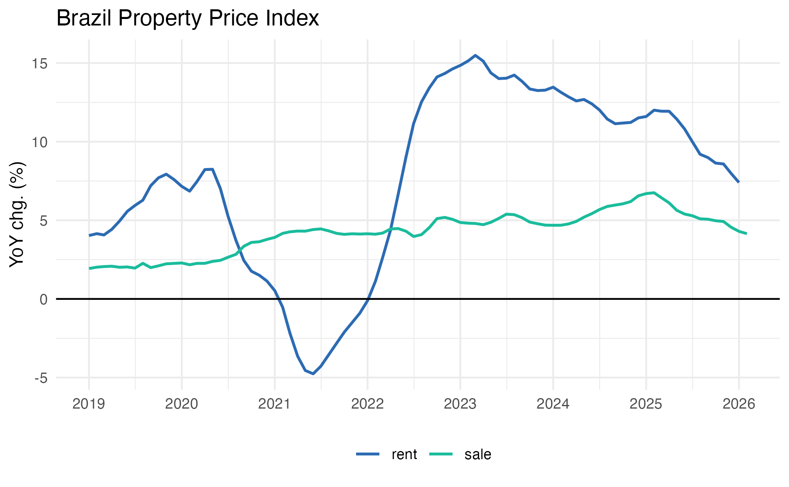
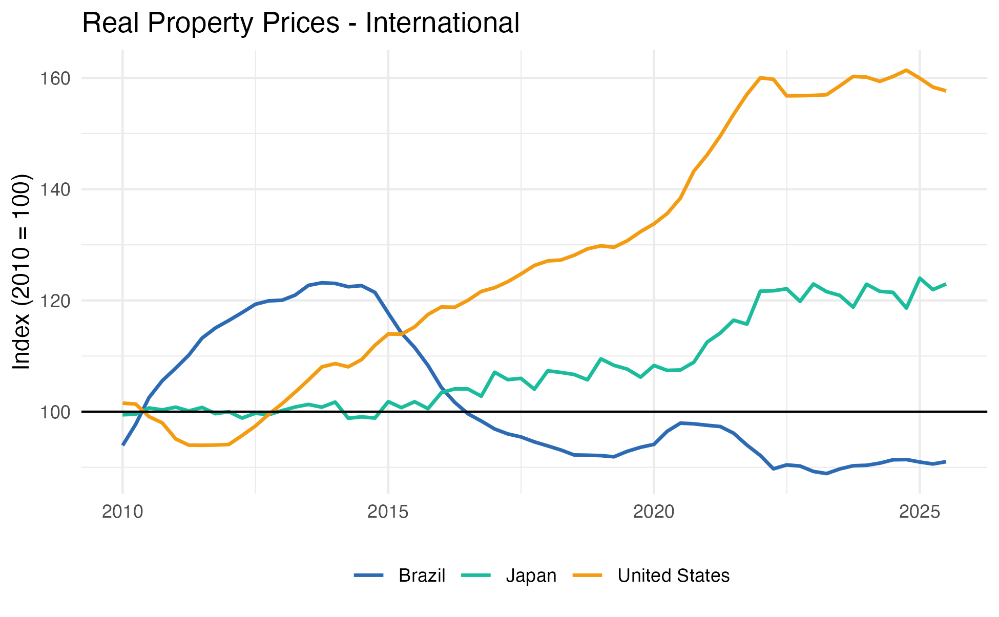

<!-- README.md is generated from README.Rmd. Please edit that file -->

```{r, include = FALSE}
knitr::opts_chunk$set(
  collapse = TRUE,
  comment = "#>"
)
```

# realestatebr

<!-- badges: start -->

<!-- badges: end -->

**realestatebr** aims to provide an unified interface to Brazilian real estate information, delivering data from different sources in a tidy format. The package is organized by source, with each source having multiple associated tables (datasets).


## Installation

```r
# Install the development version from GitHub
# install.packages("remotes")
remotes::install_github("viniciusoike/realestatebr")
```

## Quick Start

There are two key functions in **realestatebr**: `get_dataset()` and `list_datasets()`. The former retrieves data, while the latter lists all available datasets. `get_dataset()` expects a `name` and a (optional) `table` argument. If no `table` is specified, the function returns the first available table.

```{r example, eval=FALSE}
library(realestatebr)

# Discover available datasets
datasets <- list_datasets()

# Get specific table
sbpe <- get_dataset(name = "abecip", table = "sbpe")

# Get property price indices
fipezap <- get_dataset("rppi", "fipezap")
```

## Available Datasets

The package acts as a convenient wrapper around public data sources. All data is provided in a tidy format in a `tibble` object. Datasets are updated weekly or monthly, depending on the source.

| Dataset | Source | Tables | Status |
|---------|--------|--------|--------|
| `abecip` | ABECIP | `sbpe`, `units`, `cgi` | Active |
| `abrainc` | ABRAINC / FIPE | `indicator`, `radar`, `leading` | Active |
| `bcb_realestate` | Banco Central do Brasil | `accounting`, `application`, `indices`, `sources`, `units` | Active |
| `bcb_series` | Banco Central do Brasil | `price`, `credit`, `production`, `interest-rate`, `exchange`, `government`, `real-estate` | Active |
| `fgv_ibre` | FGV IBRE | — | Active |
| `rppi` | FIPE/ZAP, IVGR, IGMI, IQA, IVAR, SECOVI-SP | `sale`, `rent`, `fipezap`, `ivgr`, `igmi`, `iqa`, `iqaiw`, `ivar`, `secovi_sp` | Active |
| `rppi_bis` | Bank for International Settlements | `selected`, `detailed_monthly`, `detailed_quarterly` | Active |
| `secovi` | SECOVI-SP | `condo`, `rent`, `launch`, `sale` | Active |

### Data Sources

The `source` parameter controls where data comes from.

```r
# Auto (default): cache → GitHub → fresh
data <- get_dataset("abecip")

# User cache only (instant, offline)
data <- get_dataset("abecip", source = "cache")

# GitHub releases (requires piggyback package)
data <- get_dataset("abecip", source = "github")

# Fresh download from original source
data <- get_dataset("abecip", source = "fresh")
```

## Example: Property Price Indices

```{r rppi-example, eval = FALSE}
library(ggplot2)
library(realestatebr)
library(dplyr)

# Get FipeZap index
fipezap <- get_dataset("rppi", table = "fipezap")

# Brazil national index
rppi_spo <- fipezap |>
  filter(
    name_muni == "São Paulo",
    market == "residential",
    rooms == "total",
    variable == "acum12m",
    date >= as.Date("2019-01-01")
  )

ggplot(rppi_spo, aes(x = date, y = value, color = rent_sale)) +
  geom_line(lwd = 0.8) +
  geom_hline(yintercept = 0) +
  scale_x_date(date_breaks = "1 year", date_labels = "%Y") +
  scale_y_continuous(labels = seq(-0.05, 0.15, by = 0.05) * 100, ) +
  labs(
    title = "Brazil Property Price Index",
    x = NULL,
    y = "YoY chg. (%)",
    color = ""
  ) +
  theme_minimal() +
  theme(
    legend.position = "bottom",
    palette.colour.discrete = c("#1E3A5F", "#4A90C2", "#2C7A7B")
  )
```

<p align="center">
  
</p>

## International Comparison

```{r bis-example, eval = FALSE}
# Get BIS international data
bis <- get_dataset("rppi_bis")

# Compare countries
bis_compare <- bis |>
  filter(
    reference_area %in% c("Brazil", "United States", "Japan"),
    is_nominal == FALSE,
    unit == "Index, 2010 = 100",
    date >= as.Date("2010-01-01")
  )

ggplot(bis_compare, aes(x = date, y = value, color = reference_area)) +
  geom_line(lwd = 0.8) +
  geom_hline(yintercept = 100) +
  labs(
    title = "Real Property Prices - International",
    x = NULL,
    y = "Index (2010 = 100)",
    color = ""
  ) +
  theme_minimal() +
  theme(
    legend.position = "bottom",
    palette.colour.discrete = c("#1E3A5F", "#4A90C2", "#2C7A7B")
  )
```

<p align="center">
  
</p>

## Learn More

- [Getting Started vignette](vignettes/getting-started.Rmd)
- [Working with RPPI vignette](vignettes/working-with-rppi.Rmd)
