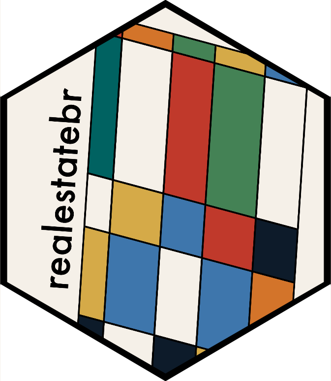
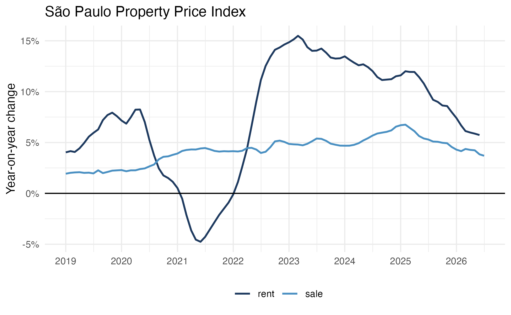
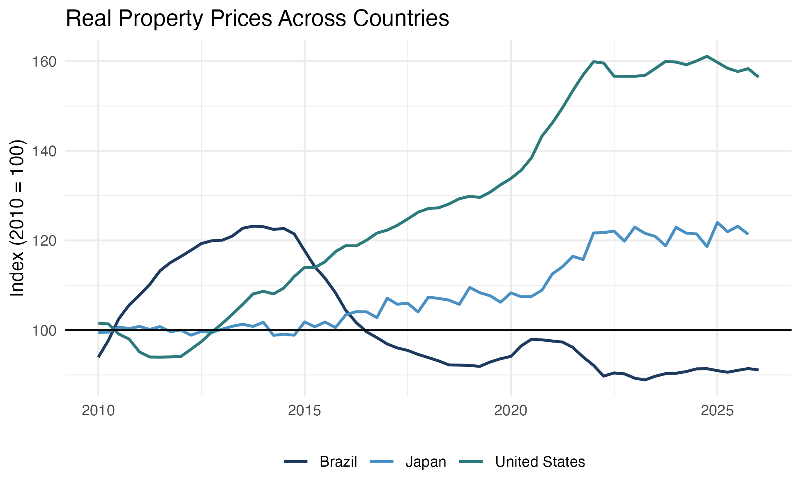

<!-- README.md is generated from README.Rmd. Please edit that file -->

```{r, include = FALSE}
knitr::opts_chunk$set(
  collapse = TRUE,
  comment = "#>"
)
```

# realestatebr: Brazilian Real Estate Data in R 

<!-- badges: start -->
[](https://CRAN.R-project.org/package=realestatebr)
[](https://CRAN.R-project.org/package=realestatebr)
[](https://github.com/viniciusoike/realestatebr/actions/workflows/R-CMD-check.yaml)
[](https://lifecycle.r-lib.org/articles/stages.html#stable)
[](https://viniciusoike.r-universe.dev/realestatebr)
<!-- badges: end -->

**realestatebr** provides a unified interface to Brazilian real estate data. The package is organized by source, and each source holds one or more tables. Every table is returned as a tidy `tibble`.

## Installation

```r
# Install the released version from CRAN
install.packages("realestatebr")

# Or install the development version from GitHub
# install.packages("remotes")
remotes::install_github("viniciusoike/realestatebr")
```

## Quick Start

Two functions cover most of the package. `get_dataset()` retrieves data and `list_datasets()` lists what is available. `get_dataset()` takes a dataset `name` and an optional `table`. Without `table`, it returns the default table for that dataset.

```{r example, eval=FALSE}
library(realestatebr)

# Discover available datasets
datasets <- list_datasets()

# Get specific table
sbpe <- get_dataset(name = "abecip", table = "sbpe")

# Get property price indices
fipezap <- get_dataset("rppi", "fipezap")
```

## Available Datasets

The package wraps public data sources and returns each table in a tidy format. Datasets are updated weekly or monthly, depending on the source.

| Dataset | Source | Tables |
|---------|--------|--------|
| `abecip` | ABECIP | `sbpe`, `units`, `cgi` |
| `abrainc` | ABRAINC / FIPE | `indicator`, `radar`, `leading` |
| `bcb_realestate` | Banco Central do Brasil | `accounting`, `application`, `indices`, `sources`, `units` |
| `bcb_series` | Banco Central do Brasil | `core`, `primary`, `secondary`, `tertiary`, `full` |
| `fgv_ibre` | FGV IBRE | — |
| `rppi` | FIPE/ZAP, IVG-R, IGMI-R, IQA, IQAIW, IVAR, SECOVI-SP | `sale`, `rent`, `all`, `fipezap`, `ivgr`, `igmi`, `iqa`, `iqaiw`, `ivar`, `secovi_sp` |
| `rppi_bis` | Bank for International Settlements | `selected`, `detailed_monthly`, `detailed_quarterly`, `detailed_annual`, `detailed_halfyearly` |
| `secovi` | SECOVI-SP | `condo`, `rent`, `launch`, `sale` |

### Data Sources

The `source` parameter controls where data comes from.

```r
# Auto (default): in-session memo -> GitHub release -> fresh download
data <- get_dataset("abecip")

# Pre-processed asset from the package's GitHub release
data <- get_dataset("abecip", source = "github")

# Fresh download from the original source
data <- get_dataset("abecip", source = "fresh")
```

Repeated calls within one R session are served from an in-memory memo.
Use `clear_session_cache()` to drop the memo without restarting R.

## Example: Property Price Indices

```{r rppi-example, eval = FALSE}
library(ggplot2)
library(realestatebr)
library(dplyr)

# Get FipeZap index
fipezap <- get_dataset("rppi", table = "fipezap")

# Residential sale and rent prices in São Paulo
rppi_spo <- fipezap |>
  filter(
    name_muni == "São Paulo",
    market == "residential",
    rooms == "total",
    variable == "acum12m",
    date >= as.Date("2019-01-01")
  )

ggplot(rppi_spo, aes(x = date, y = value, color = rent_sale)) +
  geom_line(lwd = 0.8) +
  geom_hline(yintercept = 0) +
  scale_x_date(date_breaks = "1 year", date_labels = "%Y") +
  scale_y_continuous(labels = scales::label_percent()) +
  labs(
    title = "São Paulo Property Price Index",
    x = NULL,
    y = "Year-on-year change",
    color = ""
  ) +
  theme_minimal() +
  theme(
    legend.position = "bottom",
    palette.colour.discrete = c("#1E3A5F", "#4A90C2", "#2C7A7B")
  )
```

<p align="center">
  
</p>

## International Comparison

```{r bis-example, eval = FALSE}
# Get BIS international data
bis <- get_dataset("rppi_bis")

# Compare countries
bis_compare <- bis |>
  filter(
    ref_area_name %in% c("Brazil", "United States", "Japan"),
    is_nominal == 0,
    unit == "index",
    date >= as.Date("2010-01-01")
  )

ggplot(bis_compare, aes(x = date, y = value, color = ref_area_name)) +
  geom_line(lwd = 0.8) +
  geom_hline(yintercept = 100) +
  labs(
    title = "Real Property Prices Across Countries",
    x = NULL,
    y = "Index (2010 = 100)",
    color = ""
  ) +
  theme_minimal() +
  theme(
    legend.position = "bottom",
    palette.colour.discrete = c("#1E3A5F", "#4A90C2", "#2C7A7B")
  )
```

<p align="center">
  
</p>

## Learn More

- [Getting started](https://viniciusoike.github.io/realestatebr/articles/getting-started.html)
- [Working with property price indices](https://viniciusoike.github.io/realestatebr/articles/working-with-rppi.html)
- [Housing credit in Brazil](https://viniciusoike.github.io/realestatebr/articles/housing-credit.html)
- [The primary market and the construction cycle](https://viniciusoike.github.io/realestatebr/articles/primary-market.html)
