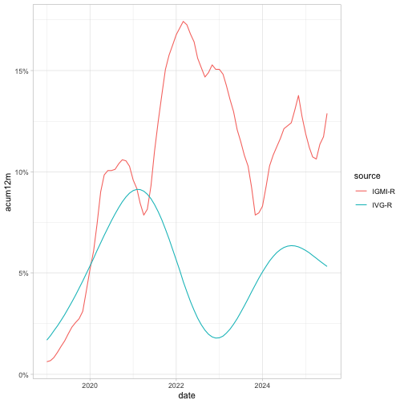

<!-- README.md is generated from README.Rmd. Please edit that file -->


# Brazilian Real Estate

<!-- badges: start -->
<!-- badges: end -->

The goal of realestatebr is to facilitate the access to reports and indicators on the Brazilian real estate market. This package currently covers only the residential market but in the future it will also encompass other real estate markets.

**Important**: This package is still under development but can already be installed. Feedback is welcome.

## Installation

You can install the development version of realestatebr from [GitHub](https://github.com/) with:

``` r
# install.packages("remotes")
remotes::install_github("viniciusoike/realestatebr")
```

## Getting Started

### New Unified Interface (Recommended)

The package now provides a modern, unified interface for accessing all datasets:


``` r
library(realestatebr)
#> Registered S3 method overwritten by 'quantmod':
#>   method            from
#>   as.zoo.data.frame zoo

# Discover available datasets
datasets <- list_datasets()
#> Error in list_datasets(): could not find function "list_datasets"
head(datasets)
#> Error: object 'datasets' not found

# Get dataset information
info <- get_dataset_info("abecip_indicators")
#> Error in get_dataset_info("abecip_indicators"): could not find function "get_dataset_info"
str(info$categories)
#> Error: object 'info' not found

# Get data with automatic fallback (GitHub cache → fresh download)
abecip <- get_dataset("abecip_indicators")
#> Error in get_dataset("abecip_indicators"): could not find function "get_dataset"
abecip
#> Error: object 'abecip' not found
```

The unified interface provides several advantages:

- **Automatic fallback**: Tries GitHub cache first, then fresh download if needed
- **Consistent naming**: All datasets use standardized English column names
- **Easy discovery**: Use `list_datasets()` to see all available data
- **Category filtering**: Access specific parts of complex datasets


``` r
# Get specific category only
sbpe <- get_dataset("abecip_indicators", category = "sbpe")
#> Error in get_dataset("abecip_indicators", category = "sbpe"): could not find function "get_dataset"
head(sbpe)
#> Error: object 'sbpe' not found

# Force fresh download
fresh_data <- get_dataset("bcb_realestate", source = "fresh")
#> Error in get_dataset("bcb_realestate", source = "fresh"): could not find function "get_dataset"
```

### Legacy Functions (Still Supported)

All existing `get_*` functions continue to work as before:


``` r
# Legacy interface still works
abecip_legacy <- get_abecip_indicators(category = "sbpe", cached = TRUE)

sbpe
#> Error: object 'sbpe' not found
```

## Available Datasets

The package provides access to comprehensive Brazilian real estate data from multiple sources:

| Dataset | Source | Description | Geography |
|---------|--------|-------------|-----------|
| `abecip_indicators` | ABECIP | Housing credit data (SBPE flows, units, home equity) | Brazil |
| `abrainc_indicators` | ABRAINC/FIPE | Primary market indicators (launches, sales, business conditions) | Brazil (major cities) |
| `bcb_realestate` | BCB | Real estate credit and market data | Brazil (by state) |
| `secovi` | SECOVI-SP | São Paulo market indicators (fees, rentals, launches, sales) | São Paulo |
| `bis_rppi` | BIS | International residential property price indices | International (60+ countries) |
| `rppi` | FIPE/ZAP | Property price indices for sales and rentals | Brazil (50+ cities) |
| `bcb_series` | BCB | Economic time series (price indices, credit, activity) | Brazil |
| `b3_stocks` | B3 | Real estate company stock data | Brazil |
| `fgv_indicators` | FGV | Real estate market indicators | Brazil |
| `cbic` | CBIC | Construction materials data (cement, steel, production) | Brazil |


``` r
# See all available datasets with details
available_data <- list_datasets()
#> Error in list_datasets(): could not find function "list_datasets"
print(available_data[, c("name", "source", "frequency", "coverage")])
#> Error: object 'available_data' not found

# Filter by source
bcb_datasets <- list_datasets(source = "BCB")
#> Error in list_datasets(source = "BCB"): could not find function "list_datasets"
print(bcb_datasets$name)
#> Error: object 'bcb_datasets' not found
```

## Residential Property Price Indexes

There are several house price indices available in the Brazilian residential real estate market. The `get_rppi_*` functions collect all of these indices. A general `get_rppi()` function


``` r
# For better plots
library(ggplot2)

# Download and clean all sales RPPIs
rppi <- get_rppi(category = "sale", stack = TRUE)
# Filter only Brazil
rppi_brazil <- subset(rppi, name_muni == "Brazil" & date >= as.Date("2019-01-01"))

ggplot(rppi_brazil, aes(date, acum12m)) +
  geom_line(aes(color = source)) +
  scale_y_continuous(labels = scales::label_percent()) +
  theme_light()
```

<div class="figure">

<p class="caption">plot of chunk unnamed-chunk-3</p>
</div>

International comparisons are also possible using the BIS data


``` r
library(dplyr, warn.conflicts = FALSE)
# Download simplified BIS RPPI data
bis <- get_rppi_bis()
# Highlight some countries, show only real indices
bis_brasil <- bis |> 
  filter(
    country %in% c("Australia", "Brazil", "Chile", "Japan", "United States"),
    is_nominal == FALSE,
    date >= as.Date("2000-01-01")
    )

ggplot(bis_brasil, aes(date, index)) +
  geom_line(aes(color = country)) +
  geom_hline(yintercept = 100) +
  theme_light() +
  theme(legend.position = "top")
```

<div class="figure">

<p class="caption">plot of chunk unnamed-chunk-4</p>
</div>
