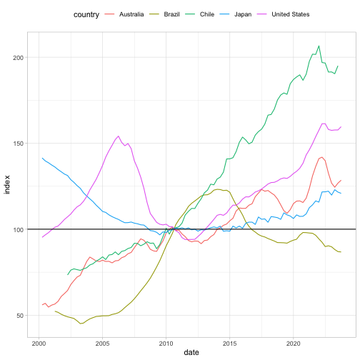

<!-- README.md is generated from README.Rmd. Please edit that file -->

# Brazilian Real Estate

<!-- badges: start -->
<!-- badges: end -->

The goal of realestatebr is to facilitate the access to reports and
indicators on the Brazilian real estate market. This package currently
covers only the residential market but in the future it will also
encompass other real estate markets.

**Important**: This package is still under development but can already
be installed. Feedback is welcome.

## Installation

You can install the development version of realestatebr from
[GitHub](https://github.com/) with:

``` r
# install.packages("remotes")
remotes::install_github("viniciusoike/realestatebr")
```

## Downloading data

To get the data use one of the `get_*` functions such as
`get_abecip_indicators`.

``` r
library(realestatebr)
# Import data from Abecip
abecip <- get_abecip_indicators()
#> Downloading data from Abecip.

abecip
#> $sbpe
#> # A tibble: 504 × 15
#>    date       sbpe_inflow sbpe_outflow sbpe_netflow sbpe_netflow_pct sbpe_yield
#>    <date>           <dbl>        <dbl>        <dbl>            <dbl>      <dbl>
#>  1 1982-01-01     238234.      261523.       -23289         -0.00939     417103
#>  2 1982-02-01     224080.      161176.        62904          0.0219           0
#>  3 1982-03-01     247219.      118663.       128556          0.0438           0
#>  4 1982-04-01     264925.      378395.      -113470         -0.0370      485995
#>  5 1982-05-01     227636.      137201.        90435          0.0263           0
#>  6 1982-06-01     319539.      154800.       164739          0.0467           0
#>  7 1982-07-01     396888.      496231.       -99343         -0.0269      642432
#>  8 1982-08-01     435464.      300647.       134817          0.0318           0
#>  9 1982-09-01     450127.      235290.       214837          0.0491           0
#> 10 1982-10-01     553766.      796712.      -242946         -0.0530      957944
#> # ℹ 494 more rows
#> # ℹ 9 more variables: sbpe_stock <dbl>, rural_inflow <dbl>,
#> #   rural_outflow <dbl>, rural_netflow <dbl>, rural_netflow_pct <dbl>,
#> #   rural_yield <dbl>, rural_stock <dbl>, total_stock <dbl>,
#> #   total_netflow <dbl>
#> 
#> $units
#> # A tibble: 258 × 7
#>    date       units_construction units_acquisition units_total
#>    <date>                  <dbl>             <dbl>       <dbl>
#>  1 2002-01-01                200              1455        1655
#>  2 2002-02-01                483              1456        1939
#>  3 2002-03-01               1049              1522        2571
#>  4 2002-04-01                684              1723        2407
#>  5 2002-05-01                571              1536        2107
#>  6 2002-06-01               1109              1536        2645
#>  7 2002-07-01                216              1706        1922
#>  8 2002-08-01                506              1838        2344
#>  9 2002-09-01               1698              1568        3266
#> 10 2002-10-01                337              1687        2024
#> # ℹ 248 more rows
#> # ℹ 3 more variables: currency_construction <dbl>, currency_acquisition <dbl>,
#> #   currency_total <dbl>
#> 
#> $cgi
#> # A tibble: 74 × 8
#>     year date       new_contracts stock_contracts       loan outstanding_balance
#>    <dbl> <date>             <dbl>           <dbl>      <dbl>               <dbl>
#>  1  2017 2017-01-01          1323          108661 181295778.         12725110368
#>  2  2017 2017-02-01          1197          101825 157080758.         11120992240
#>  3  2017 2017-03-01          1324           99712 195053012.         10598834209
#>  4  2017 2017-04-01           809           99340 132217320.         10514921327
#>  5  2017 2017-05-01           926          102869 174307187.         10385660359
#>  6  2017 2017-06-01           982           98730 187235000.         10447518680
#>  7  2017 2017-07-01           928           98359 193399742.         10352878117
#>  8  2017 2017-08-01           905           97960 185871532.         10281067567
#>  9  2017 2017-09-01           781           97438 156978364.         10213587373
#> 10  2017 2017-10-01           808           96938 173597857.         10175771850
#> # ℹ 64 more rows
#> # ℹ 2 more variables: average_term <dbl>, default_rate <dbl>
```

Outputs will be either a named `list` of `tibbles` or a single `tibble`.
All `get_*` functions have two arguments: `category` and `cached`. The
`category` argument helps to filter the final result and will always
default to `'all'`. The `cached` argument is a `logical` that indicates
whether to download the data directly from this GitHub repository. This
option will usually be faster.

``` r
sbpe <- get_abecip_indicators(category = "sbpe")
#> Downloading data from Abecip.

sbpe
#> # A tibble: 504 × 15
#>    date       sbpe_inflow sbpe_outflow sbpe_netflow sbpe_netflow_pct sbpe_yield
#>    <date>           <dbl>        <dbl>        <dbl>            <dbl>      <dbl>
#>  1 1982-01-01     238234.      261523.       -23289         -0.00939     417103
#>  2 1982-02-01     224080.      161176.        62904          0.0219           0
#>  3 1982-03-01     247219.      118663.       128556          0.0438           0
#>  4 1982-04-01     264925.      378395.      -113470         -0.0370      485995
#>  5 1982-05-01     227636.      137201.        90435          0.0263           0
#>  6 1982-06-01     319539.      154800.       164739          0.0467           0
#>  7 1982-07-01     396888.      496231.       -99343         -0.0269      642432
#>  8 1982-08-01     435464.      300647.       134817          0.0318           0
#>  9 1982-09-01     450127.      235290.       214837          0.0491           0
#> 10 1982-10-01     553766.      796712.      -242946         -0.0530      957944
#> # ℹ 494 more rows
#> # ℹ 9 more variables: sbpe_stock <dbl>, rural_inflow <dbl>,
#> #   rural_outflow <dbl>, rural_netflow <dbl>, rural_netflow_pct <dbl>,
#> #   rural_yield <dbl>, rural_stock <dbl>, total_stock <dbl>,
#> #   total_netflow <dbl>
```

## Residential Property Price Indexes

There are several house price indices available in the Brazilian
residential real estate market. The `get_rppi_*` functions collect all
of these indices. A general `get_rppi()` function

``` r
# For better plots
library(ggplot2)

# Download and clean all sales RPPIs
rppi <- get_rppi(category = "sale", stack = TRUE)
# Filter only Brazil
rppi_brazil <- subset(rppi, name_muni == "Brazil" & date >= as.Date("2019-01-01"))

ggplot(rppi_brazil, aes(date, acum12m)) +
  geom_line(aes(color = source)) +
  scale_y_continuous(labels = scales::label_percent()) +
  theme_light()
```


International comparisons are also possible using the BIS data

``` r
library(dplyr, warn.conflicts = FALSE)
# Download simplified BIS RPPI data
bis <- get_rppi_bis()
# Highlight some countries, show only real indices
bis_brasil <- bis |> 
  filter(
    country %in% c("Australia", "Brazil", "Chile", "Japan", "United States"),
    is_nominal == FALSE,
    date >= as.Date("2000-01-01")
    )

ggplot(bis_brasil, aes(date, index)) +
  geom_line(aes(color = country)) +
  geom_hline(yintercept = 100) +
  theme_light() +
  theme(legend.position = "top")
```


