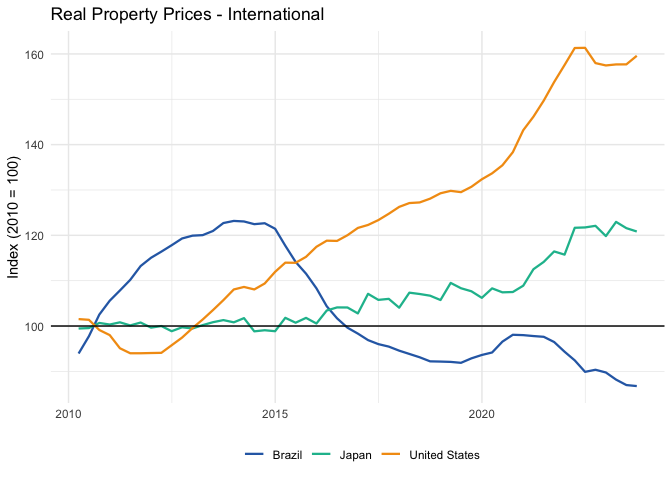

<!-- README.md is generated from README.Rmd. Please edit that file -->

# realestatebr 

<!-- badges: start -->

<!-- badges: end -->

**realestatebr** aims to provide an unified interface to Brazilian real
estate information, delivering data from different sources in a tidy
format. The package is organized by source, with each source having
multiple associated tables (datasets).

## Installation

``` r
# install.packages("remotes")
remotes::install_github("viniciusoike/realestatebr")
```

## Quick Start

There are two key functions in **realestatebr**: `get_dataset()` and
`list_datasets()`. The former retrieves data, while the latter lists all
available datasets. `get_dataset()` expects a `name` and a (optional)
`table` argument. If no `table` is specified, the function returns the
first available table.

``` r
library(realestatebr)

# Discover available datasets
datasets <- list_datasets()

# Get specific table
sbpe <- get_dataset(name = "abecip", table = "sbpe")

# Get property price indices
fipezap <- get_dataset("rppi", "fipezap")
```

## Available Datasets

Some of the available datasets are listed below.

| Dataset | Producer | Description |
|----|----|----|
| `abecip` | ABECIP | Housing credit flows, financed units, home equity |
| `abrainc` | ABRAINC/FIPE | Primary market indicators (launches, sales) |
| `bcb_realestate` | BCB | Real estate credit and market data |
| `secovi` | SECOVI-SP | São Paulo market indicators |
| `rppi` | Multiple | Property price indices (sale/rent, 50+ cities) |
| `rppi_bis` | BIS | International property price indices (60+ countries) |
| `bcb_series` | BCB | Economic time series |
| `cbic` | CBIC | Cement consumption and production |

## Caching

### How Caching Works

On first use, datasets are automatically downloaded from GitHub releases
and cached in your user directory. Subsequent uses load data instantly
from cache, even offline.

``` r
# First use: downloads and caches (~3-5 seconds)
data1 <- get_dataset("abecip")

# Subsequent uses: loads from cache (instant)
data2 <- get_dataset("abecip")
```

### Managing Cache

``` r
# Check cache location
get_user_cache_dir()

# List cached datasets
list_cached_files()

# Clear specific dataset
clear_user_cache("abecip")

# Clear all cache (with confirmation)
clear_user_cache()

# Update cache from GitHub
update_cache_from_github("abecip")
```

### Data Sources

The `source` parameter controls where data comes from.

``` r
# Auto (default): cache → GitHub → fresh
data <- get_dataset("abecip")

# User cache only (instant, offline)
data <- get_dataset("abecip", source = "cache")

# GitHub releases (requires piggyback package)
data <- get_dataset("abecip", source = "github")

# Fresh download from original source
data <- get_dataset("abecip", source = "fresh")
```

## Example: Property Price Indices

``` r
library(ggplot2)
library(realestatebr)
library(dplyr, warn.conflicts = FALSE)

# Get FipeZap index
fipezap <- get_dataset("rppi", table = "fipezap")

# Brazil national index
rppi_spo <- fipezap |>
  filter(
    name_muni == "São Paulo",
    market == "residential",
    rooms == "total",
    variable == "acum12m",
    date >= as.Date("2019-01-01")
  )

ggplot(rppi_spo, aes(x = date, y = value, color = rent_sale)) +
  geom_line(lwd = 0.8) +
  geom_hline(yintercept = 0) +
  scale_x_date(date_breaks = "1 year", date_labels = "%Y") +
  scale_y_continuous(labels = seq(-0.05, 0.15, by = 0.05) * 100, ) +
  labs(
    title = "Brazil Property Price Index",
    x = NULL,
    y = "YoY chg. (%)",
    color = ""
  ) +
  theme_minimal() +
  theme(
    legend.position = "bottom",
    palette.colour.discrete = c("#2C6BB3", "#1abc9c", "#f39c12")
  )
```


## International Comparison

``` r
# Get BIS international data
bis <- get_dataset("rppi_bis")

# Compare countries
bis_compare <- bis |>
  filter(
    reference_area %in% c("Brazil", "United States", "Japan"),
    is_nominal == FALSE,
    unit == "Index, 2010 = 100",
    date >= as.Date("2010-01-01")
  )

ggplot(bis_compare, aes(x = date, y = value, color = reference_area)) +
  geom_line(lwd = 0.8) +
  geom_hline(yintercept = 100) +
  labs(
    title = "Real Property Prices - International",
    x = NULL,
    y = "Index (2010 = 100)",
    color = "") +
  theme_minimal() +
  theme(
    legend.position = "bottom",
    palette.colour.discrete = c("#2C6BB3", "#1abc9c", "#f39c12")
  )
```



## Learn More

- [Getting Started vignette](vignettes/getting-started.Rmd)
- [Working with RPPI vignette](vignettes/working-with-rppi.Rmd)
