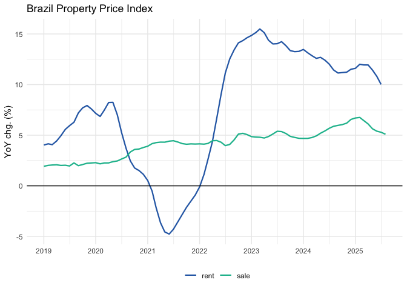

<!-- README.md is generated from README.Rmd. Please edit that file -->

# realestatebr

<!-- badges: start -->

<!-- badges: end -->

The **realestatebr** package provides easy access to Brazilian real
estate market data from multiple authoritative sources. Access property
price indices, housing credit indicators, construction materials data,
and more—all through a unified, consistent interface.

## Installation

``` r
# install.packages("remotes")
remotes::install_github("viniciusoike/realestatebr")
```

## Quick Start

``` r
library(realestatebr)

# Discover available datasets
datasets <- list_datasets()

# Get housing credit data
abecip <- get_dataset("abecip")

# Get specific table
sbpe <- get_dataset("abecip", table = "sbpe")

# Get property price indices
rppi <- get_dataset("rppi", table = "fipezap")
```

## Available Datasets

The package provides access to 10+ datasets from authoritative sources:

| Dataset | Source | Description |
|----|----|----|
| `abecip` | ABECIP | Housing credit flows, financed units, home equity |
| `abrainc` | ABRAINC/FIPE | Primary market indicators (launches, sales) |
| `bcb_realestate` | BCB | Real estate credit and market data |
| `secovi` | SECOVI-SP | São Paulo market indicators |
| `rppi` | Multiple | Property price indices (sale/rent, 50+ cities) |
| `rppi_bis` | BIS | International property price indices (60+ countries) |
| `bcb_series` | BCB | Economic time series |
| `cbic` | CBIC | Cement consumption and production |

``` r
# See all datasets
list_datasets()

# Filter by source
list_datasets(source = "BCB")
```

## Example: Property Price Indices

``` r
library(ggplot2)
library(realestatebr)
library(dplyr, warn.conflicts = FALSE)

# Get FipeZap index
fipezap <- get_dataset("rppi", table = "fipezap")
#> Attempting to load rppi from GitHub cache...
#> Loaded 'rppi_fipe' from cache
#> Successfully loaded from GitHub cache
#> Retrieved 'fipezap' from 'rppi'. Available tables: 'fipezap', 'ivgr', 'igmi',
#> 'iqa', 'ivar', 'secovi_sp', 'sale', 'rent', 'all'

# Brazil national index
rppi_spo <- fipezap |>
  filter(
    name_muni == "São Paulo",
    market == "residential",
    rooms == "total",
    variable == "acum12m",
    date >= as.Date("2019-01-01")
  )

ggplot(rppi_spo, aes(x = date, y = value, color = rent_sale)) +
  geom_line(lwd = 0.8) +
  geom_hline(yintercept = 0) +
  scale_x_date(date_breaks = "1 year", date_labels = "%Y") +
  scale_y_continuous(labels = seq(-0.05, 0.15, by = 0.05) * 100, ) +
  labs(
    title = "Brazil Property Price Index",
    x = NULL,
    y = "YoY chg. (%)",
    color = ""
  ) +
  theme_minimal() +
  theme(
    legend.position = "bottom",
    palette.colour.discrete = c("#2C6BB3", "#1abc9c", "#f39c12")
  )
#> Warning: Removed 1 row containing missing values or values outside the scale range
#> (`geom_line()`).
```



## International Comparison

``` r
# Get BIS international data
bis <- get_dataset("rppi_bis")
#> Attempting to load rppi_bis from GitHub cache...
#> Loaded 'bis_selected' from cache
#> Successfully loaded from GitHub cache
#> Retrieved 'selected' from 'rppi_bis' (default table). Available tables:
#> 'selected', 'detailed_monthly', 'detailed_quarterly', 'detailed_annual',
#> 'detailed_semiannual'

# Compare countries
bis_compare <- bis |>
  filter(
    reference_area %in% c("Brazil", "United States", "Japan"),
    is_nominal == FALSE,
    unit == "Index, 2010 = 100",
    date >= as.Date("2010-01-01")
  )

ggplot(bis_compare, aes(x = date, y = value, color = reference_area)) +
  geom_line(lwd = 0.8) +
  geom_hline(yintercept = 100) +
  labs(
    title = "Real Property Prices - International",
    x = NULL,
    y = "Index (2010 = 100)",
    color = "") +
  theme_minimal() +
  theme(
    legend.position = "bottom",
    palette.colour.discrete = c("#2C6BB3", "#1abc9c", "#f39c12")
  )
```


## What’s New

**v0.4.0** introduces a unified `get_dataset()` interface replacing all
individual `get_*()` functions. This is a breaking change. See
[NEWS.md](NEWS.md) for migration details.

## Learn More

- [Getting Started vignette](vignettes/getting-started.Rmd)
- [Working with RPPI vignette](vignettes/working-with-rppi.Rmd)
