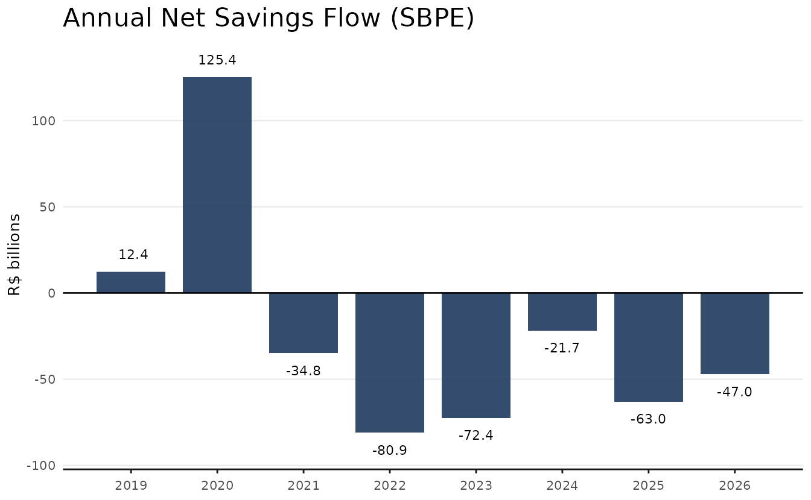
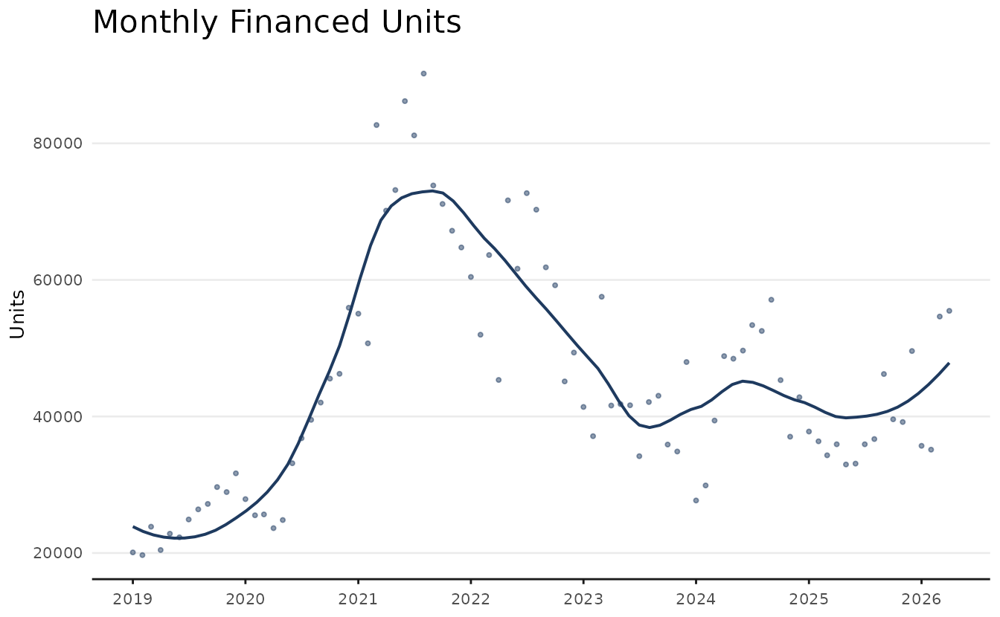
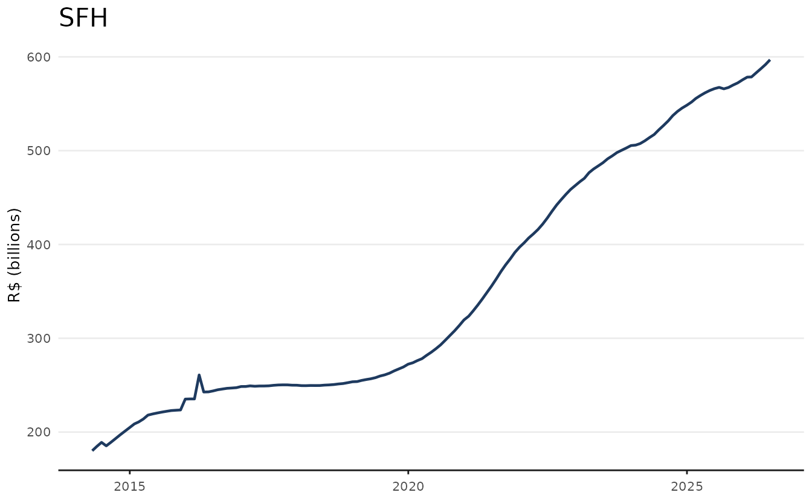
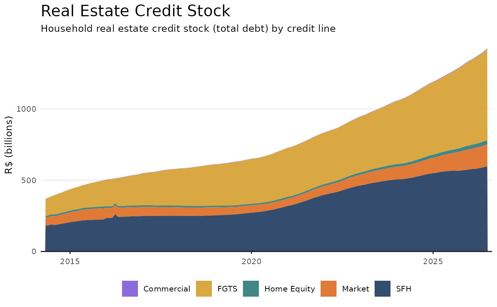

# Getting Started with realestatebr

## Introduction

`realestatebr` gathers Brazilian real estate data from several public
sources and returns every table as a tidy `tibble`. This vignette covers
the core functions and works through two examples. Since the package
returns tibbles, we recommend using it together with `dplyr`.

``` r

library(realestatebr)
library(dplyr)
```

The code below defines an optional common theme for the plots in this
vignette. It can be omitted.

``` r

library(ggplot2)

color_palette <- c(
  "#1E3A5F",
  "#DD6B20",
  "#2C7A7B",
  "#D69E2E",
  "#805AD5",
  "#C53030"
)

theme_series <- function() {
  theme_minimal(base_size = 10) +
    theme(
      plot.title = element_text(size = 16),
      panel.grid.minor = element_blank(),
      panel.grid.major.x = element_blank(),
      axis.line.x = element_line(color = "gray10", linewidth = 0.5),
      axis.ticks.x = element_line(color = "gray10", linewidth = 0.5),
      axis.title.x = element_blank(),
      legend.position = "bottom",
      palette.color.discrete = color_palette
    )
}
```

## Core interface

`get_dataset(name, table)` retrieves any dataset in the package. Without
a `table` argument it returns the default table; use `table` to select a
specific sub-table.

``` r

# Default table
abecip <- get_dataset("abecip")

# Specific table
units <- get_dataset("abecip", table = "units")
```

To explore which datasets are available, use
[`list_datasets()`](https://viniciusoike.github.io/realestatebr/reference/list_datasets.md)
and
[`get_dataset_info()`](https://viniciusoike.github.io/realestatebr/reference/get_dataset_info.md).

- **[`list_datasets()`](https://viniciusoike.github.io/realestatebr/reference/list_datasets.md)**
  returns a catalogue of the available datasets and their tables.

``` r

ds <- list_datasets()
```

| name | title | source | available_tables | frequency |
|:---|:---|:---|:---|:---|
| abecip | ABECIP Housing Credit Indicators | ABECIP - Associação Brasileira das Entidades de Crédito Imobiliário | sbpe, units, cgi | monthly |
| abrainc | ABRAINC-FIPE Primary Market Indicators | ABRAINC/FIPE | indicator, radar, leading | quarterly |
| bcb_realestate | BCB Real Estate Market Data | Banco Central do Brasil | accounting, application, indices, sources, units | monthly |
| bcb_series | BCB Economic Series | Banco Central do Brasil - SGS | core, primary, secondary, tertiary, full | varies (daily/monthly/quarterly) |
| fgv_ibre | FGV IBRE Real Estate Indicators | FGV IBRE | (single table) | monthly |
| rppi | Brazilian Residential Property Price Indices | Multiple (FIPE/ZAP, IVGR, IGMI, IQA, IQAIW, IVAR, SECOVI-SP) | fipezap, ivgr, igmi, iqa, iqaiw, ivar, secovi_sp, sale, rent, all | monthly |
| rppi_bis | BIS Residential Property Price Indices | Bank for International Settlements | selected, detailed_monthly, detailed_quarterly, detailed_annual, detailed_halfyearly | quarterly |
| secovi | SECOVI-SP Real Estate Market Data | SECOVI-SP - Sindicato da Habitação | condo, rent, launch, sale | monthly |

- **[`get_dataset_info()`](https://viniciusoike.github.io/realestatebr/reference/get_dataset_info.md)**
  shows available tables and metadata for a given dataset.

``` r

info <- get_dataset_info("abecip")
names(info$categories)
#> [1] "sbpe"  "units"  "cgi"
```

### The `source` argument

The `source` argument of
[`get_dataset()`](https://viniciusoike.github.io/realestatebr/reference/get_dataset.md)
controls where data comes from. The default (`"auto"`) reads the
in-session memo if present, falls back to the package’s GitHub release,
and finally falls back to a fresh download from the original source. The
default suits most uses. Pass `"github"` to force the pre-processed
asset, or `"fresh"` to pull from the original source, which is slower
but current.

``` r

get_dataset("abecip", source = "github") # pre-processed asset from GitHub release
get_dataset("abecip", source = "fresh") # direct from the original source
```

Repeated calls within one R session are served from an in-memory memo,
so fetching the same dataset twice does not re-download. Use
[`clear_session_cache()`](https://viniciusoike.github.io/realestatebr/reference/clear_session_cache.md)
to drop the memo without restarting R.

## Example: housing credit cycle

SBPE (Sistema Brasileiro de Poupança e Empréstimo) is the primary
funding mechanism for residential mortgages in Brazil. The `sbpe` table
from `abecip` tracks deposits into and withdrawals from savings
accounts, which finance construction and home purchases.

``` r

sbpe <- get_dataset("abecip", table = "sbpe")

glimpse(sbpe)
#> Rows: 540
#> Columns: 15
#> $ date              <date> 1982-01-01, 1982-02-01, 1982-03-01, 1982-04-01, 198…
#> $ sbpe_inflow       <dbl> 238234.1, 224080.0, 247218.8, 264925.0, 227636.3, 31…
#> $ sbpe_outflow      <dbl> 261523.1, 161176.0, 118662.8, 378395.0, 137201.3, 15…
#> $ sbpe_netflow      <dbl> -23289, 62904, 128556, -113470, 90435, 164739, -9934…
#> $ sbpe_netflow_pct  <dbl> -0.009387130, 0.021881448, 0.043761242, -0.037006429…
#> $ sbpe_yield        <dbl> 417103, 0, 0, 485995, 0, 0, 642432, 0, 0, 957944, 0,…
#> $ sbpe_stock        <dbl> 2874764, 2937668, 3066224, 3438749, 3529184, 3693923…
#> $ rural_inflow      <dbl> NA, NA, NA, NA, NA, NA, NA, NA, NA, NA, NA, NA, NA, …
#> $ rural_outflow     <dbl> NA, NA, NA, NA, NA, NA, NA, NA, NA, NA, NA, NA, NA, …
#> $ rural_netflow     <dbl> NA, NA, NA, NA, NA, NA, NA, NA, NA, NA, NA, NA, NA, …
#> $ rural_netflow_pct <dbl> NA, NA, NA, NA, NA, NA, NA, NA, NA, NA, NA, NA, NA, …
#> $ rural_yield       <dbl> NA, NA, NA, NA, NA, NA, NA, NA, NA, NA, NA, NA, NA, …
#> $ rural_stock       <dbl> NA, NA, NA, NA, NA, NA, NA, NA, NA, NA, NA, NA, NA, …
#> $ total_stock       <dbl> NA, NA, NA, NA, NA, NA, NA, NA, NA, NA, NA, NA, NA, …
#> $ total_netflow     <dbl> NA, NA, NA, NA, NA, NA, NA, NA, NA, NA, NA, NA, NA, …
```

The plot below shows the annual net savings flow in recent years.

``` r

# Annual net credit flow
sbpe_annual <- sbpe |>
  filter(date >= as.Date("2019-01-01")) |>
  mutate(year = lubridate::year(date)) |>
  summarise(net_flow = sum(sbpe_netflow, na.rm = TRUE) / 1e3, .by = year) |>
  mutate(
    label_num = format(round(net_flow, 1)),
    ypos = if_else(net_flow > 0, net_flow + 10, net_flow - 10)
  )

ggplot(sbpe_annual, aes(year, net_flow)) +
  geom_col(fill = color_palette[1], alpha = 0.9, width = 0.8) +
  geom_text(aes(y = ypos, label = label_num), size = 3) +
  geom_hline(yintercept = 0) +
  scale_x_continuous(breaks = scales::breaks_pretty(n = 8)) +
  labs(
    title = "Annual Net Savings Flow (SBPE)",
    x = NULL,
    y = "R$ billions"
  ) +
  theme_series()
```



The companion table `"units"` contains monthly counts of financed units.

``` r

units <- get_dataset("abecip", table = "units")

glimpse(units)
#> Rows: 294
#> Columns: 7
#> $ date                  <date> 2002-01-01, 2002-02-01, 2002-03-01, 2002-04-01,…
#> $ units_construction    <dbl> 200, 483, 1049, 684, 571, 1109, 216, 506, 1698, …
#> $ units_acquisition     <dbl> 1455, 1456, 1522, 1723, 1536, 1536, 1706, 1838, …
#> $ units_total           <dbl> 1655, 1939, 2571, 2407, 2107, 2645, 1922, 2344, …
#> $ currency_construction <dbl> 13.540470, 32.117295, 62.592800, 44.422429, 23.4…
#> $ currency_acquisition  <dbl> 83.95237, 96.12279, 101.71222, 108.14803, 98.281…
#> $ currency_total        <dbl> 97.49284, 128.24008, 164.30502, 152.57046, 121.7…
```

The plot shows the number of units financed per month, with a LOESS
trend line.

``` r

# Monthly SBPE units financed
units_recent <- units |>
  filter(date >= as.Date("2019-01-01"))

ggplot(units_recent, aes(date, units_total)) +
  geom_point(alpha = 0.5, size = 0.8, color = color_palette[1]) +
  geom_smooth(
    color = color_palette[1],
    lwd = 0.8,
    se = FALSE,
    method = stats::loess,
    method.args = list(span = 0.4)
  ) +
  scale_x_date(date_breaks = "1 year", date_labels = "%Y") +
  labs(
    title = "Monthly Financed Units",
    y = "Units"
  ) +
  theme_series()
```



## Example: real estate credit portfolio

The `bcb_realestate` dataset holds real estate statistics from the
Brazilian Central Bank. The dataset is large and exploring it takes some
patience. Each series is uniquely identified by `date` and
`series_info`, and the helper columns `v1` through `v5`, `abbrev_state`,
`category`, and `type` split that identifier into parts you can filter
on.

The code below reads a single series and then a group of related series.

``` r

bcb <- get_dataset("bcb_realestate")

# Get a specific series
sfh_pf <- bcb |>
  filter(series_info == "credito_estoque_carteira_credito_pf_sfh_br")

# Get all related series for 'estoque_carteira_credito_pf'
credit_stock <- bcb |>
  filter(
    category == "credito",
    type == "estoque",
    v1 == "carteira",
    v2 == "credito",
    v3 == "pf",
    # since v4 is left blank, we get all credit lines
    v5 == "br"
  )

# The helper columns essentially separate the 'series_info' column allowing
# for easier filtering. It's equivalent to filtering by regex
credit_stock <- bcb |>
  filter(grepl(
    "(?<=credito_estoque_carteira_credito_pf_).+_br$",
    series_info,
    perl = TRUE
  ))
```

The single series shows only the values from SFH (specific credit line).

``` r

ggplot(sfh_pf, aes(date, value / 1e9)) +
  geom_line(lwd = 0.8, color = color_palette[1]) +
  labs(title = "SFH", y = "R$ (billions)") +
  theme_series()
```



The grouped series show the entire household credit stock by credit
line.

``` r

credit_stock <- credit_stock |>
  mutate(
    credit_line_label = dplyr::recode(
      v4,
      `home-equity` = "Home Equity",
      comercial = "Commercial",
      livre = "Market",
      fgts = "FGTS",
      sfh = "SFH"
    )
  )

ggplot(credit_stock, aes(date, value / 1e9)) +
  geom_area(aes(fill = credit_line_label), alpha = 0.9) +
  scale_fill_manual(values = rev(color_palette[1:5])) +
  scale_x_date(expand = expansion(mult = c(0.01))) +
  scale_y_continuous(expand = expansion(mult = c(0, 0.05))) +
  labs(
    title = "Real Estate Credit Stock",
    subtitle = "Household real estate credit stock (total debt) by credit line",
    y = "R$ (billions)",
    fill = NULL
  ) +
  theme_series()
```



One caveat when joining tables: `bcb_realestate` uses end-of-month
dates, such as `2023-01-31`, while most other datasets use the first day
of the month. Use `lubridate::floor_date(date, "month")` to align them.

## Reference: all datasets

The available datasets are listed below.

| Dataset | Source | Tables |
|----|----|----|
| `abecip` | ABECIP | `sbpe`, `units`, `cgi` |
| `abrainc` | ABRAINC / FIPE | `indicator`, `radar`, `leading` |
| `bcb_realestate` | Banco Central do Brasil | `accounting`, `application`, `indices`, `sources`, `units` |
| `bcb_series` | Banco Central do Brasil | `core`, `primary`, `secondary`, `tertiary`, `full` |
| `fgv_ibre` | FGV IBRE | — |
| `rppi` | FIPE/ZAP, IVG-R, IGMI-R, IQA, IQAIW, IVAR, SECOVI-SP | `sale`, `rent`, `all`, `fipezap`, `ivgr`, `igmi`, `iqa`, `iqaiw`, `ivar`, `secovi_sp` |
| `rppi_bis` | Bank for International Settlements | `selected`, `detailed_monthly`, `detailed_quarterly`, `detailed_annual`, `detailed_halfyearly` |
| `secovi` | SECOVI-SP | `condo`, `rent`, `launch`, `sale` |
