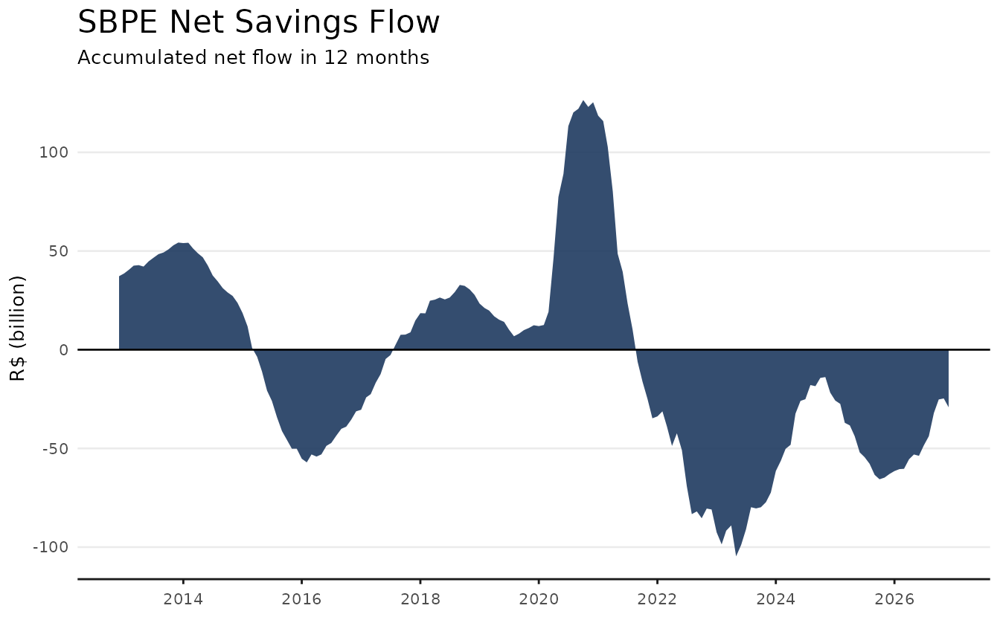
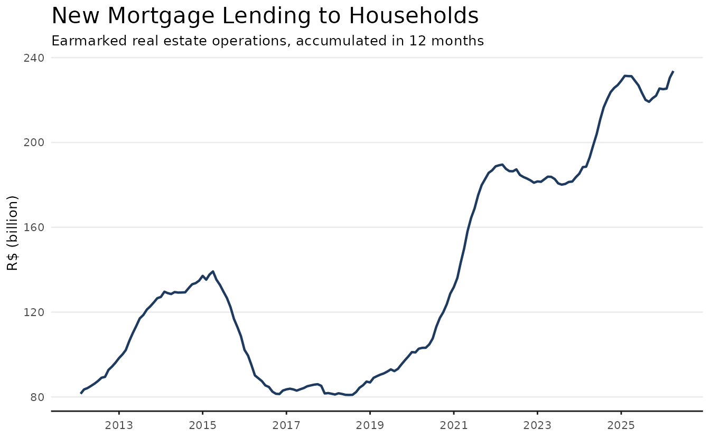
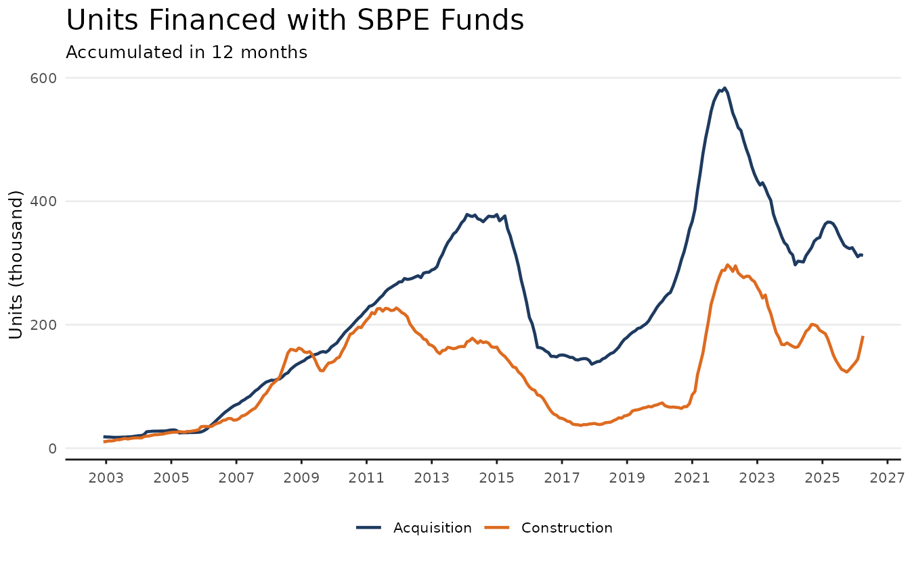
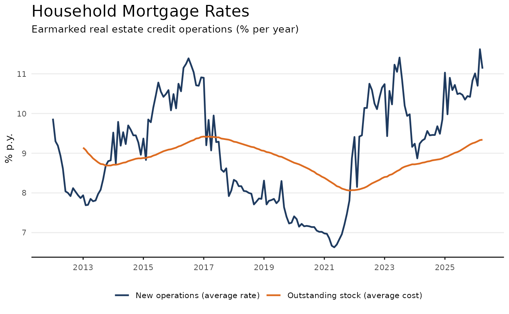
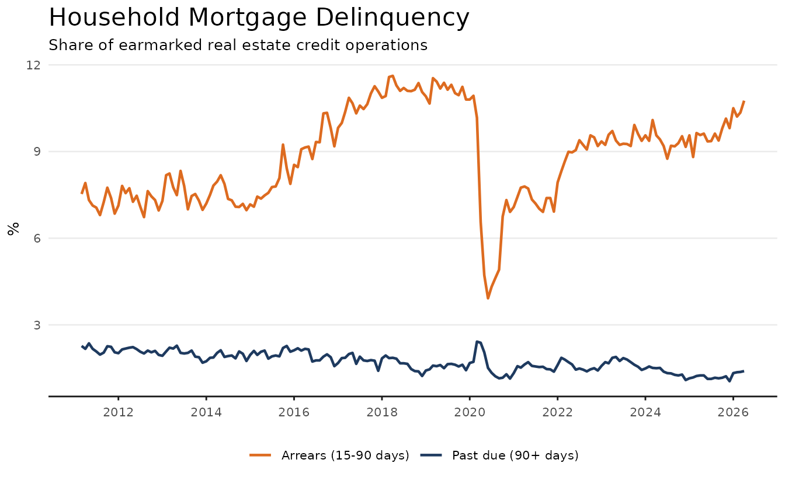
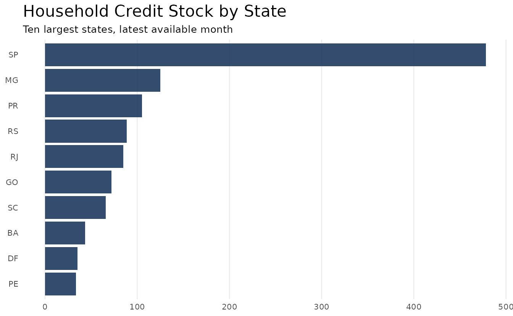
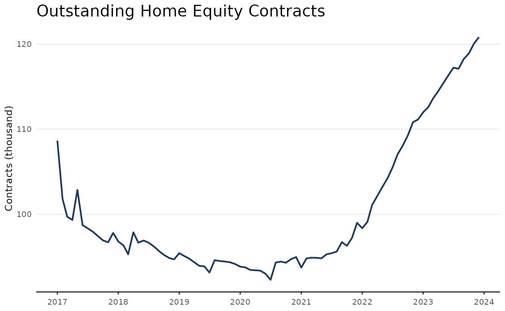

# Housing Credit in Brazil

Housing credit in Brazil is organized around the SFH (Sistema Financeiro
da Habitação), in which most mortgages are funded by savings deposits
(SBPE) and by the FGTS workers’ fund. This article follows the credit
cycle from funding to lending using three datasets

- `abecip` for savings flows and financed units,
- `bcb_series` for lending volumes, rates, and delinquency,
- `bcb_realestate` for the regional distribution of the credit stock.

``` r

library(realestatebr)
library(dplyr)
library(ggplot2)
```

The code below defines a common theme for the plots in this article. It
is entirely optional and can be omitted.

``` r

color_palette <- c(
  "#1E3A5F",
  "#DD6B20",
  "#2C7A7B",
  "#D69E2E",
  "#805AD5",
  "#C53030"
)

theme_series <- function() {
  theme_minimal(base_size = 10) +
    theme(
      plot.title = element_text(size = 16),
      panel.grid.minor = element_blank(),
      panel.grid.major.x = element_blank(),
      axis.line.x = element_line(color = "gray10", linewidth = 0.5),
      axis.ticks.x = element_line(color = "gray10", linewidth = 0.5),
      axis.title.x = element_blank(),
      legend.position = "bottom",
      palette.color.discrete = color_palette
    )
}
```

## Funding: savings deposits

SBPE savings accounts are the cheapest funding source for mortgages, so
sustained withdrawals eventually constrain new lending. The `sbpe` table
from `abecip` tracks monthly deposits, withdrawals, and the resulting
stock.

``` r

sbpe <- get_dataset("abecip", table = "sbpe")

glimpse(sbpe)
#> Rows: 540
#> Columns: 15
#> $ date              <date> 1982-01-01, 1982-02-01, 1982-03-01, 1982-04-01, 198…
#> $ sbpe_inflow       <dbl> 238234.1, 224080.0, 247218.8, 264925.0, 227636.3, 31…
#> $ sbpe_outflow      <dbl> 261523.1, 161176.0, 118662.8, 378395.0, 137201.3, 15…
#> $ sbpe_netflow      <dbl> -23289, 62904, 128556, -113470, 90435, 164739, -9934…
#> $ sbpe_netflow_pct  <dbl> -0.009387130, 0.021881448, 0.043761242, -0.037006429…
#> $ sbpe_yield        <dbl> 417103, 0, 0, 485995, 0, 0, 642432, 0, 0, 957944, 0,…
#> $ sbpe_stock        <dbl> 2874764, 2937668, 3066224, 3438749, 3529184, 3693923…
#> $ rural_inflow      <dbl> NA, NA, NA, NA, NA, NA, NA, NA, NA, NA, NA, NA, NA, …
#> $ rural_outflow     <dbl> NA, NA, NA, NA, NA, NA, NA, NA, NA, NA, NA, NA, NA, …
#> $ rural_netflow     <dbl> NA, NA, NA, NA, NA, NA, NA, NA, NA, NA, NA, NA, NA, …
#> $ rural_netflow_pct <dbl> NA, NA, NA, NA, NA, NA, NA, NA, NA, NA, NA, NA, NA, …
#> $ rural_yield       <dbl> NA, NA, NA, NA, NA, NA, NA, NA, NA, NA, NA, NA, NA, …
#> $ rural_stock       <dbl> NA, NA, NA, NA, NA, NA, NA, NA, NA, NA, NA, NA, NA, …
#> $ total_stock       <dbl> NA, NA, NA, NA, NA, NA, NA, NA, NA, NA, NA, NA, NA, …
#> $ total_netflow     <dbl> NA, NA, NA, NA, NA, NA, NA, NA, NA, NA, NA, NA, NA, …
```

The plot shows the accumulated net flow over twelve months. Periods of
persistent outflows, such as the years after 2021, signal tighter
funding ahead.

``` r

sbpe_flows <- sbpe |>
  filter(date >= as.Date("2012-01-01")) |>
  mutate(
    netflow_12m = zoo::rollsumr(sbpe_netflow, k = 12, fill = NA) / 1e3
  )

ggplot(sbpe_flows, aes(date, netflow_12m)) +
  geom_area(fill = color_palette[1], alpha = 0.9) +
  geom_hline(yintercept = 0) +
  scale_x_date(date_breaks = "2 years", date_labels = "%Y") +
  labs(
    title = "SBPE Net Savings Flow",
    subtitle = "Accumulated net flow in 12 months",
    y = "R$ (billion)"
  ) +
  theme_series()
```



## Lending: new mortgage loans

The flow of new real estate loans to households is reported by the
Central Bank. The series below is part of the `core` table of
`bcb_series`, which gathers the most relevant real estate credit series.

``` r

bcb <- get_dataset("bcb_series", table = "core")

fimob <- bcb |>
  filter(name_simplified == "fimob_pf_total") |>
  mutate(
    lending_12m = zoo::rollsumr(value, k = 12, fill = NA) / 1e3
  )
```

``` r

ggplot(filter(fimob, !is.na(lending_12m)), aes(date, lending_12m)) +
  geom_line(color = color_palette[1], lwd = 0.8) +
  scale_x_date(date_breaks = "2 years", date_labels = "%Y") +
  labs(
    title = "New Mortgage Lending to Households",
    subtitle = "Earmarked real estate operations, accumulated in 12 months",
    y = "R$ (billion)"
  ) +
  theme_series()
```



In physical terms, the `units` table from `abecip` counts how many homes
were financed with SBPE funds, split between construction and
acquisition loans.

``` r

units <- get_dataset("abecip", table = "units")

units_12m <- units |>
  select(date, units_construction, units_acquisition) |>
  tidyr::pivot_longer(-date, names_to = "type", values_to = "units") |>
  mutate(
    units_12m = zoo::rollsumr(units, k = 12, fill = NA) / 1e3,
    type_label = if_else(
      type == "units_construction", "Construction", "Acquisition"
    ),
    .by = type
  )
```

``` r

ggplot(filter(units_12m, !is.na(units_12m)), aes(date, units_12m)) +
  geom_line(aes(color = type_label), lwd = 0.8) +
  scale_color_manual(values = color_palette[c(1, 2)]) +
  scale_x_date(date_breaks = "2 years", date_labels = "%Y") +
  labs(
    title = "Units Financed with SBPE Funds",
    subtitle = "Accumulated in 12 months",
    y = "Units (thousand)",
    color = NULL
  ) +
  theme_series()
```



## The price of credit

Mortgage rates move with monetary policy but are partly insulated by
regulated pricing within the SFH. The `core` table includes both the
average rate charged on new operations and the average cost of the
outstanding stock, which adjusts much more slowly.

``` r

rates <- bcb |>
  filter(name_simplified %in% c("taxa_fimob_pf_total", "icc_fimob")) |>
  mutate(
    rate_label = if_else(
      name_simplified == "icc_fimob",
      "Outstanding stock (average cost)",
      "New operations (average rate)"
    )
  )

rates_recent <- filter(rates, date >= as.Date("2012-01-01"))
```

``` r

ggplot(rates_recent, aes(date, value)) +
  geom_line(aes(color = rate_label), lwd = 0.8) +
  scale_color_manual(values = color_palette[c(1, 2)]) +
  scale_x_date(date_breaks = "2 years", date_labels = "%Y") +
  labs(
    title = "Household Mortgage Rates",
    subtitle = "Earmarked real estate credit operations (% per year)",
    y = "% p.y.",
    color = NULL
  ) +
  theme_series()
```



## Credit risk

Delinquency in housing credit is structurally low because loans are
collateralized. Even so, arrears track the economic cycle.

``` r

risk <- bcb |>
  filter(
    name_simplified %in% c(
      "inad_credito_direcionado_pf_fimob",
      "atraso_fimob_pf_total"
    )
  ) |>
  mutate(
    risk_label = if_else(
      name_simplified == "atraso_fimob_pf_total",
      "Arrears (15-90 days)",
      "Past due (90+ days)"
    )
  )
```

``` r

ggplot(risk, aes(date, value)) +
  geom_line(aes(color = risk_label), lwd = 0.8) +
  scale_color_manual(values = color_palette[c(2, 1)]) +
  scale_x_date(date_breaks = "2 years", date_labels = "%Y") +
  labs(
    title = "Household Mortgage Delinquency",
    subtitle = "Share of earmarked real estate credit operations",
    y = "%",
    color = NULL
  ) +
  theme_series()
```



## Where the credit is

The `bcb_realestate` dataset breaks the credit stock down by state. The
code below sums the household credit portfolio across credit lines for
the latest available month.

``` r

bcb_re <- get_dataset("bcb_realestate")

stock_states <- bcb_re |>
  filter(
    category == "credito",
    type == "estoque",
    v1 == "carteira",
    v2 == "credito",
    v3 == "pf",
    abbrev_state != "BR",
    date == max(date)
  ) |>
  summarise(stock = sum(value) / 1e9, .by = abbrev_state) |>
  slice_max(stock, n = 10)
```

``` r

ggplot(stock_states, aes(reorder(abbrev_state, stock), stock)) +
  geom_col(fill = color_palette[1], alpha = 0.9) +
  coord_flip() +
  labs(
    title = "Household Credit Stock by State",
    subtitle = "Ten largest states, latest available month",
    x = NULL,
    y = "R$ (billion)"
  ) +
  theme_series() +
  theme(
    panel.grid.major.x = element_line(),
    panel.grid.major.y = element_blank(),
    axis.line.x = element_blank(),
    axis.ticks.x = element_blank()
  )
```



## Home equity lending

Home equity loans (CGI, Crédito com Garantia de Imóvel) remain a small
but growing market. The `cgi` table from `abecip` summarizes contracts,
balances, and default rates.

``` r

cgi <- get_dataset("abecip", table = "cgi")

glimpse(cgi)
#> Rows: 84
#> Columns: 8
#> $ year                <dbl> 2017, 2017, 2017, 2017, 2017, 2017, 2017, 2017, 20…
#> $ date                <date> 2017-01-01, 2017-02-01, 2017-03-01, 2017-04-01, 2…
#> $ new_contracts       <dbl> 1323, 1197, 1324, 809, 926, 982, 928, 905, 781, 80…
#> $ stock_contracts     <dbl> 108661, 101825, 99712, 99340, 102869, 98730, 98359…
#> $ loan                <dbl> 181295778, 157080758, 195053012, 132217320, 174307…
#> $ outstanding_balance <dbl> 12725110368, 11120992240, 10598834209, 10514921327…
#> $ average_term        <dbl> 144.8, 145.3, 140.8, 130.2, 134.3, 128.7, 137.4, 1…
#> $ default_rate        <dbl> 4.8, 5.0, 4.9, 5.2, 4.7, 4.4, 5.0, 4.7, 4.6, 4.7, …
```

``` r

ggplot(cgi, aes(date, stock_contracts / 1e3)) +
  geom_line(color = color_palette[1], lwd = 0.8) +
  scale_x_date(date_breaks = "1 year", date_labels = "%Y") +
  labs(
    title = "Outstanding Home Equity Contracts",
    y = "Contracts (thousand)"
  ) +
  theme_series()
```



## Learn more

The column-level documentation of each dataset used here is available in
the help topics
[`?abecip`](https://viniciusoike.github.io/realestatebr/reference/abecip.md),
[`?bcb_series`](https://viniciusoike.github.io/realestatebr/reference/bcb_series.md),
and
[`?bcb_realestate`](https://viniciusoike.github.io/realestatebr/reference/bcb_realestate.md).
For price indices, see the vignette
[`vignette("working-with-rppi")`](https://viniciusoike.github.io/realestatebr/articles/working-with-rppi.md).
