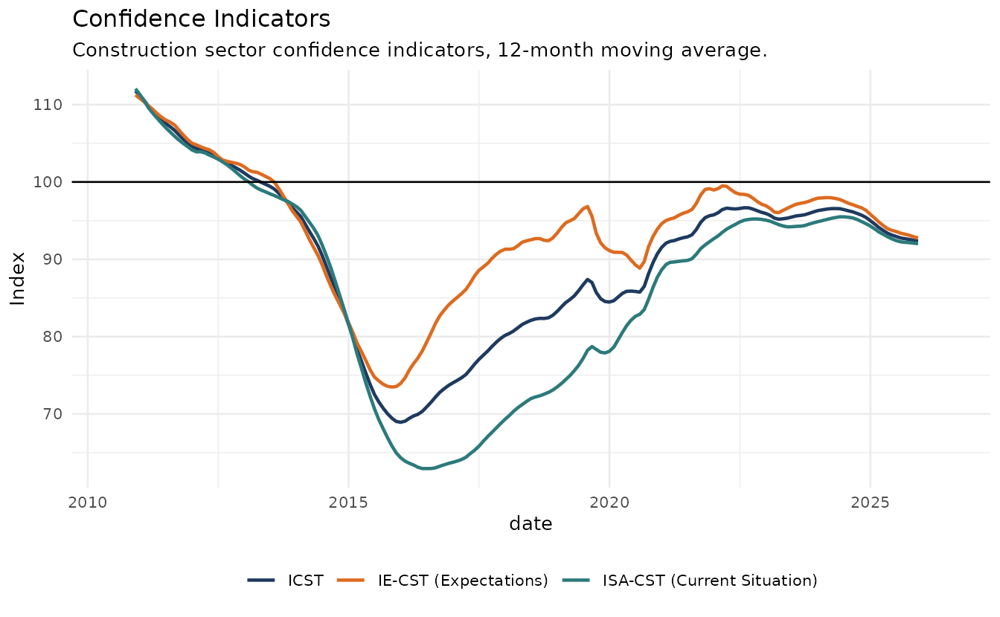
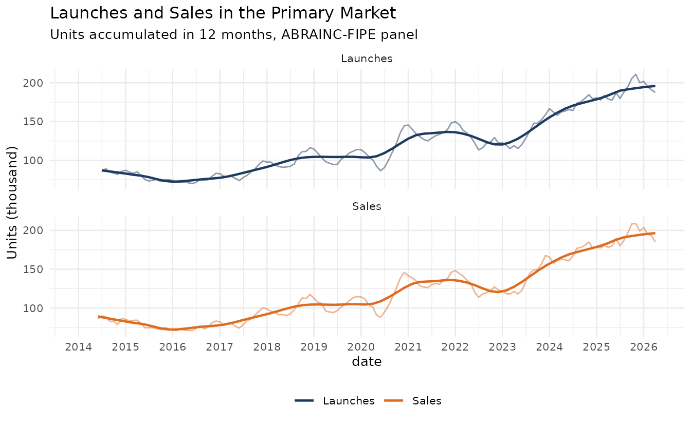
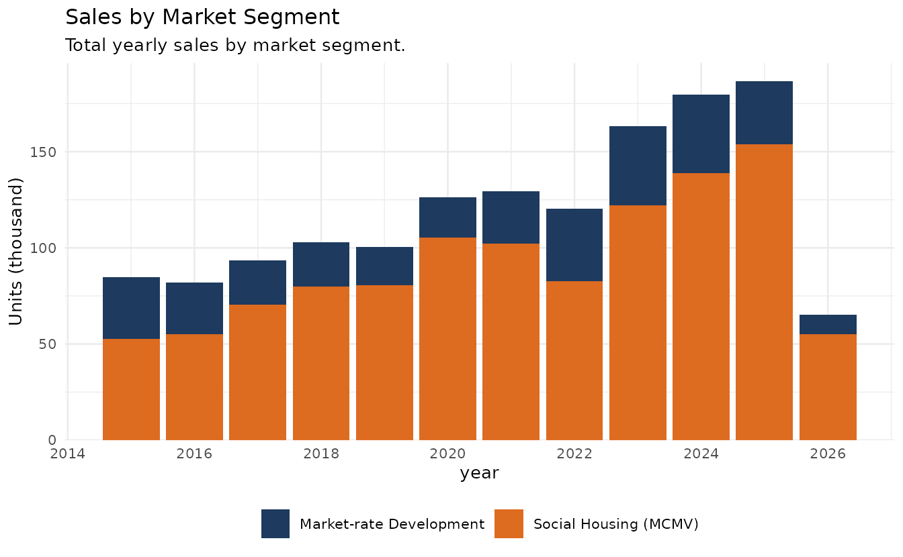
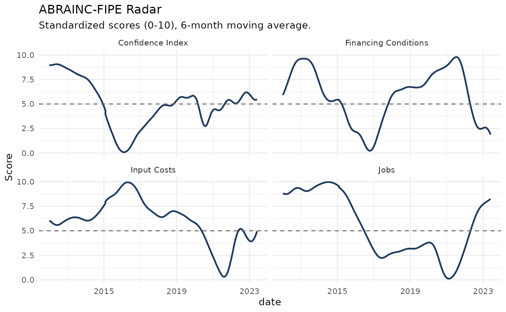
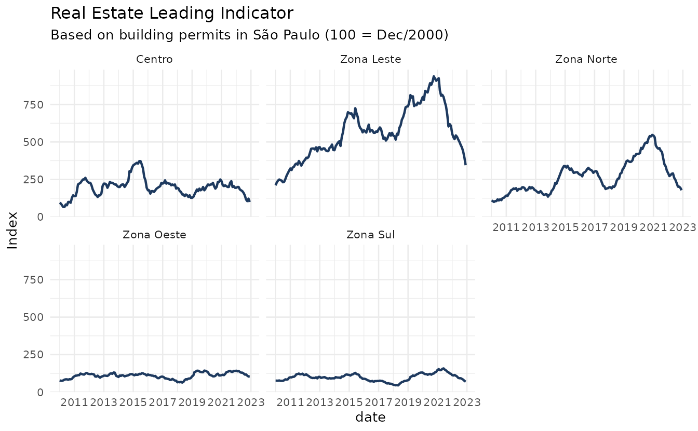
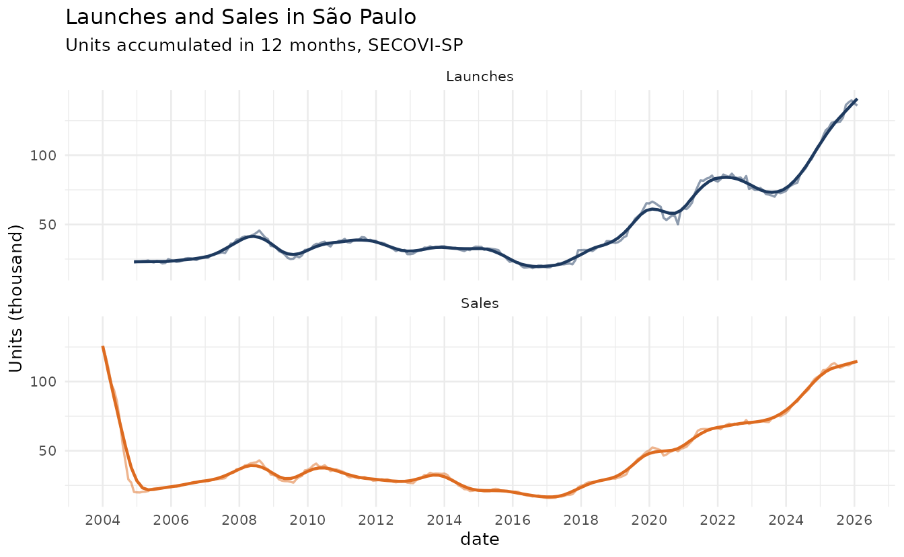
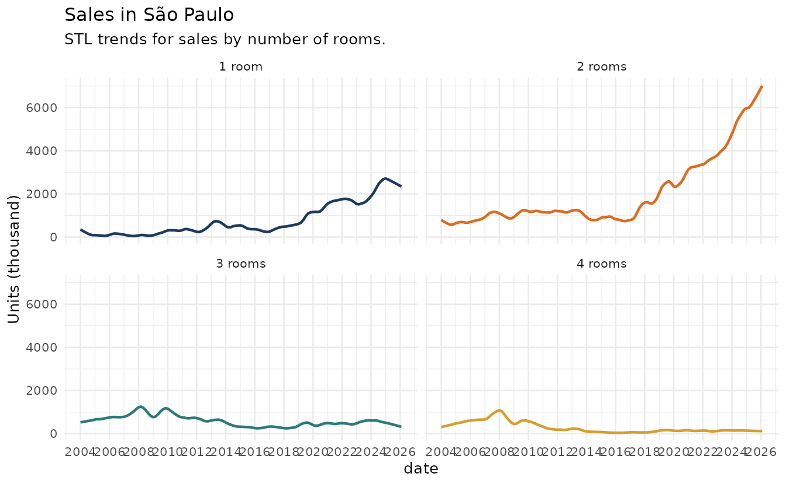

# The Primary Market and the Construction Cycle

This article follows the development cycle, from launches to sales and
deliveries, and the business environment around it. Three datasets do
the work.

- `abrainc` for national primary market indicators from the ABRAINC-FIPE
  panel of developers
- `secovi` for the São Paulo market
- `fgv_ibre` for construction costs and business sentiment

The aim is to show what these datasets hold, not to settle any question
about the market. Besides the usual `dplyr` and `ggplot2`, we use the
`trendseries` package to estimate trends and cycles.

``` r

library(realestatebr)
library(trendseries)
library(dplyr)
library(ggplot2)
```

The code below defines a common theme for the plots in this article and
can be omitted.

``` r

if (requireNamespace("ekioplot", quietly = TRUE)) {
  color_palette <- ekioplot::ekio_pal()
  theme_series <- function() {
    ekioplot::theme_ekio(base_size = 10) +
      theme(
        palette.color.discrete = color_palette
      )
  }
} else {
  color_palette <- c(
    "#1E3A5F",
    "#DD6B20",
    "#2C7A7B",
    "#D69E2E",
    "#805AD5",
    "#C53030"
  )
  theme_series <- function() {
    theme_minimal(base_size = 10) +
      theme(
        legend.position = "bottom",
        palette.color.discrete = color_palette
      )
  }
}
```

## Construction costs and sentiment

The `fgv_ibre` dataset gathers indicators from Fundação Getulio Vargas
(FGV). FGV runs a wide range of surveys, and `realestatebr` collects the
ones most relevant to construction and real estate. The `name_series`
and `code_series` columns identify each series.

``` r

fgv <- get_dataset("fgv_ibre")

count(fgv, name_series, name_simplified)
#> # A tibble: 15 × 3
#>    name_series                                             name_simplified     n
#>    <chr>                                                   <chr>           <int>
#>  1 ICST Com ajuste Sazonal - Índice de Confiança da Const… ic_cst            193
#>  2 IE-CST Com ajuste Sazonal - Índice de Expectativas da … ie_cst            193
#>  3 INCC - 1o Decendio                                      incc_1o_decend…   259
#>  4 INCC - 2o Decendio                                      incc_2o_decend…   259
#>  5 INCC - Brasil                                           incc_brasil       361
#>  6 INCC - Brasil - DI                                      incc_brasil_di    360
#>  7 INCC - Brasil-10                                        incc_brasil_10    361
#>  8 INCC - Fechamento Mensal                                incc              361
#>  9 ISA-CST Com ajuste Sazonal - Índice da Situação Atual … isa_cst           193
#> 10 Sondagem da Construção – Nível de Utilização da Capaci… nuci              160
#> 11 Índice de Variação de Aluguéis Residenciais (IVAR) - B… ivar_belo_hori…    91
#> 12 Índice de Variação de Aluguéis Residenciais (IVAR) - M… ivar_brazil        91
#> 13 Índice de Variação de Aluguéis Residenciais (IVAR) - P… ivar_porto_ale…    91
#> 14 Índice de Variação de Aluguéis Residenciais (IVAR) - R… ivar_rio_de_ja…    91
#> 15 Índice de Variação de Aluguéis Residenciais (IVAR) - S… ivar_sao_paulo     91
```

The plot below shows the confidence indicators of the construction
sector. ICST is the overall index, which averages the IE-CST
(expectations) and the ISA-CST (current situation). Although these
series are already seasonally adjusted, we smooth them with a 12-month
moving average to make them more stable. As with most confidence
indicators, the values are normalized: values above 100 indicate a more
favorable assessment, while values below 100 indicate a less favorable
assessment.

``` r

confidence <- fgv |>
  filter(name_simplified %in% c("ic_cst", "ie_cst", "isa_cst")) |>
  augment_trends(group_cols = "name_simplified", methods = "ma") |>
  mutate(
    indicator = case_when(
      name_simplified == "ic_cst" ~ "ICST",
      name_simplified == "ie_cst" ~ "IE-CST (Expectations)",
      name_simplified == "isa_cst" ~ "ISA-CST (Current Situation)"
    )
  )

ggplot(confidence, aes(date, trend_ma)) +
  geom_line(aes(color = indicator), lwd = 0.8) +
  geom_hline(yintercept = 100) +
  labs(
    title = "Confidence Indicators",
    subtitle = "Construction sector confidence indicators, 12-month moving average.",
    y = "Index",
    color = NULL
  ) +
  theme_series()
```



## Launches and sales

The `indicator` table from `abrainc` reports monthly launches, sales,
deliveries, cancellations, and supply for a panel of large developers.
The series are volatile, so the plot below uses values accumulated over
twelve months.

``` r

abrainc <- get_dataset("abrainc", table = "indicator")

glimpse(abrainc)
#> Rows: 3,552
#> Columns: 6
#> $ date           <date> 2014-01-01, 2014-01-01, 2014-01-01, 2014-01-01, 2014-0…
#> $ year           <dbl> 2014, 2014, 2014, 2014, 2014, 2014, 2014, 2014, 2014, 2…
#> $ category       <chr> "new_units", "new_units", "new_units", "new_units", "so…
#> $ variable       <chr> "total", "market_rate", "social_housing", "other", "tot…
#> $ value          <dbl> 1726.0000, NA, NA, NA, 4232.0000, NA, NA, NA, 6409.0000…
#> $ variable_label <chr> "Total", "Market-rate Development", "Social Housing (MC…
```

``` r

abrainc_trends <- abrainc |>
  filter(
    category %in% c("new_units", "sold"),
    variable == "total"
  ) |>
  mutate(
    units_12m = zoo::rollsumr(value, k = 12, fill = NA) / 1e3,
    category_label = case_when(
      category == "new_units" ~ "Launches",
      category == "sold" ~ "Sales",
      TRUE ~ NA_character_
    )
  ) |>
  trendseries::augment_trends(
    value_col = "units_12m",
    group_cols = "category_label"
  )

ggplot(abrainc_trends, aes(date, units_12m, color = category_label)) +
  geom_line(lwd = 0.5, alpha = 0.5) +
  geom_line(aes(y = trend_stl), lwd = 0.8) +
  facet_wrap(vars(category_label), ncol = 1) +
  scale_x_date(date_breaks = "1 year", date_labels = "%Y") +
  labs(
    title = "Launches and Sales in the Primary Market",
    subtitle = "Units accumulated in 12 months, ABRAINC-FIPE panel",
    y = "Units (thousand)",
    color = NULL
  ) +
  theme_series()
```



## Market segments

Brazil has two large segments: (1) social housing production, which is
financed and subsidized by the “Minha Casa Minha Vida” program (usually
abbreviated as “MCMV”); and (2) market-rate developments. The ABRAINC
dataset reports sales and launches for each of these markets.

``` r

segments <- abrainc |>
  filter(
    category == "sold",
    variable %in% c("market_rate", "social_housing")
  ) |>
  summarise(
    year_total = if (anyNA(value)) NA_real_ else sum(value) / 1e3,
    .by = c("variable_label", "year")
  ) |>
  filter(!is.na(year_total))

ggplot(segments, aes(year, year_total)) +
  geom_col(aes(fill = variable_label)) +
  scale_x_continuous(breaks = scales::breaks_pretty(n = 8)) +
  scale_y_continuous(expand = expansion(mult = c(0, 0.05))) +
  labs(
    title = "Sales by Market Segment",
    subtitle = "Total yearly sales by market segment.",
    y = "Units (thousand)",
    fill = NULL
  ) +
  theme_series()
```



## Business conditions

The `radar` table condenses the business environment into standardized
0-10 scores across four dimensions: (1) macroeconomy; (2) credit; (3)
demand; and (4) the real estate sector. The plot shows one
representative indicator from each dimension, smoothed with a six-month
moving average. Note that the moving average is already bundled with the
data in the `ma6` column.

``` r

radar <- get_dataset("abrainc", table = "radar")

radar_sel <- radar |>
  filter(
    variable %in%
      c("confidence", "finance_condition", "employment", "input_costs"),
    date >= as.Date("2012-01-01")
  )

ggplot(radar_sel, aes(date, ma6)) +
  geom_line(color = color_palette[1], lwd = 0.8) +
  geom_hline(yintercept = 5, linetype = 2, color = "gray40") +
  facet_wrap(vars(variable_label)) +
  scale_x_date(date_breaks = "4 years", date_labels = "%Y") +
  labs(
    title = "ABRAINC-FIPE Radar",
    subtitle = "Standardized scores (0-10), 6-month moving average.",
    y = "Score"
  ) +
  theme_series()
```



The radar indicator has been discontinued upstream, so the series ends
at its last published month. The [GitHub
issue](https://github.com/viniciusoike/realestatebr/issues/6) tracks its
status.

## São Paulo

São Paulo is Brazil’s largest real estate market, and two sources cover
it here. The `leading` table from `abrainc` reports building permits in
the city, while `secovi` reports supply and sales for the city and the
metropolitan region.

### A leading indicator

Building permits anticipate construction activity. The `leading` table
compiles permits in the city of São Paulo into a leading indicator of
real estate activity.

``` r

leading <- get_dataset("abrainc", table = "leading")

leading_index <- leading |>
  filter(
    variable == "leading_index",
    zone != "Total",
    date >= as.Date("2010-01-01")
  )

ggplot(leading_index, aes(date, value)) +
  geom_line(color = color_palette[1], lwd = 0.8) +
  facet_wrap(vars(zone)) +
  scale_x_date(date_breaks = "2 years", date_labels = "%Y") +
  labs(
    title = "Real Estate Leading Indicator",
    subtitle = "Based on building permits in São Paulo (100 = Dec/2000)",
    y = "Index"
  ) +
  theme_series()
```



### Supply and sales

The `launch` and `sale` tables from `secovi` track new supply and sales
in the city.

``` r

secovi <- get_dataset("secovi")

count(secovi, category, variable)
#> # A tibble: 12 × 3
#>    category variable               n
#>    <chr>    <chr>              <int>
#>  1 condo    default_condominio   240
#>  2 condo    icon                1746
#>  3 launch   launches             532
#>  4 launch   supply               266
#>  5 rent     acao_locaticia      1980
#>  6 rent     rent_price           236
#>  7 rent     tipos_de_garantia    618
#>  8 sale     sales                798
#>  9 sale     sales_1rooms         798
#> 10 sale     sales_2rooms         798
#> 11 sale     sales_3rooms         798
#> 12 sale     sales_4rooms         798
```

``` r

sp_market <- secovi |>
  filter(
    variable %in% c("launches", "sales"),
    name == "unidades"
  ) |>
  mutate(
    units_12m = zoo::rollsumr(value, k = 12, fill = NA) / 1e3
  ) |>
  trendseries::augment_trends(
    value_col = "units_12m",
    group_cols = "variable"
  ) |>
  mutate(
    variable_label = if_else(variable == "launches", "Launches", "Sales")
  )

ggplot(sp_market, aes(date)) +
  geom_line(
    aes(y = units_12m, color = variable_label),
    lwd = 0.6,
    alpha = 0.5
  ) +
  geom_line(aes(y = trend_stl, color = variable_label), lwd = 0.8) +
  facet_wrap(vars(variable_label), ncol = 1) +
  scale_x_date(date_breaks = "2 years", date_labels = "%Y") +
  guides(color = "none") +
  labs(
    title = "Launches and Sales in São Paulo",
    subtitle = "Units accumulated in 12 months, SECOVI-SP",
    y = "Units (thousand)",
    color = NULL
  ) +
  theme_series()
```



Some series break the totals down further. The plot below shows sales by
number of rooms.

``` r

sp_market_rooms <- secovi |>
  filter(
    grepl("sales_[0-9]rooms", variable),
    name == "unidades"
  ) |>
  trendseries::augment_trends(group_cols = "variable") |>
  mutate(
    variable_label = regmatches(variable, regexpr("\\d+", variable)),
    variable_label = if_else(
      variable == "sales_1rooms",
      paste(variable_label, "room"),
      paste(variable_label, "rooms")
    )
  )

ggplot(sp_market_rooms, aes(date)) +
  geom_line(aes(y = trend_stl, color = variable_label), lwd = 0.8) +
  facet_wrap(vars(variable_label)) +
  scale_x_date(date_breaks = "2 years", date_labels = "%Y") +
  guides(color = "none") +
  labs(
    title = "Sales in São Paulo",
    subtitle = "STL trends for sales by number of rooms.",
    y = "Units (thousand)"
  ) +
  theme_series()
```



## Learn more

The help topics
[`?abrainc`](https://viniciusoike.github.io/realestatebr/reference/abrainc.md),
[`?secovi`](https://viniciusoike.github.io/realestatebr/reference/secovi.md),
and
[`?fgv_ibre`](https://viniciusoike.github.io/realestatebr/reference/fgv_ibre.md)
document the columns of each dataset used here. For housing credit, see
[Housing Credit in
Brazil](https://viniciusoike.github.io/realestatebr/articles/housing-credit.md);
for price indices, see
[`vignette("working-with-rppi")`](https://viniciusoike.github.io/realestatebr/articles/working-with-rppi.md).
