# Working with Property Price Indices

## Introduction

This vignette provides a brief introduction to Residential Property
Price Indices (RPPI) in the `realestatebr` package. Since `realestatebr`
returns `tibble` as default values, we recommend using it together with
the `dplyr` package, though conversion do `data.table` is trivial.

``` r

library(realestatebr)
library(dplyr)
```

The code below defines a common theme for all plots in this vignette and
is required to fully replicate the code in this document. Despite this,
this code is entirely optional and can be omitted.

``` r

library(ggplot2)

color_palette <- c(
  "#1E3A5F",
  "#DD6B20",
  "#2C7A7B",
  "#D69E2E",
  "#805AD5",
  "#C53030"
)

theme_series <- function() {
  theme_minimal(
    # swap for other font if needed
    base_family = "Avenir",
    base_size = 10
    ) +
    theme(
      plot.title = element_text(size = 16),
      panel.grid.minor = element_blank(),
      panel.grid.major.x = element_blank(),
      axis.line.x = element_line(color = "gray10", linewidth = 0.5),
      axis.ticks.x = element_line(color = "gray10", linewidth = 0.5),
      axis.title.x = element_blank(),
      legend.position = "bottom",
      palette.color.discrete = color_palette
    )
}
```

Brazil has several residential property price indices (RPPIs) from
different institutions, each with distinct methodologies, geographic
coverage, and time spans. This vignette shows how to access and work
with each one.

## Recommended Workflow

Before getting into all the details, it’s convenient to establish which
are the “best” indices to use.

### The best indices

The two most consistent indices are the IGMI-R (for sale prices) and the
IVAR (for rent prices). The only available option for commercial prices
is FipeZap. These indices are sourced from good datasets and are built
with a robust methodology.

The IGMI-R is a hedonic price index based on transaction prices of
housing mortgages. The only shortcoming of the index is its relatively
short time span (2014-present) and geographic coverage (major cities
only).

The IVAR is a repeat-rent index based on residential rental contracts.
Unfortunately, the dataset has a very short time span (2019-present) and
even more limited geographic coverage (only 4 cities).

FipeZap has the broadest geographic (50+ cities) and temporal coverage
(2008-present), but is based on median listing prices rather than
transaction prices. As a result, the index is much less reliable.

The IGMI-R and IVAR are the most precise indices for sales and rent,
respectively, and should be used for most applications.

### Working with realestatebr

To get a dataset, use
[`get_dataset()`](https://viniciusoike.github.io/realestatebr/reference/get_dataset.md)

``` r

igmi <- get_dataset("rppi", table = "igmi")
ivar <- get_dataset("rppi", table = "ivar")
fipezap <- get_dataset("rppi", table = "fipezap")
```

For easier comparison between indices, the `table` parameter accepts a
`"sale"` or `"rent"` argument, which stacks all available indices into a
single `tibble`.

``` r

sale <- get_dataset("rppi", table = "sale")
rent <- get_dataset("rppi", table = "rent")
```

## Sale Indices

### IVG-R

The IVG-R (Índice de Valores de Garantia de Imóveis Residenciais) is
published by the Brazilian Central Bank. It covers the national market
from 2001 and is widely regarded as the official RPPI in Brazil. The
index is based on median appraisal prices from mortgage contracts,
smoothed with a 3-month moving average and the HP filter.

``` r

ivgr <- get_dataset("rppi", "ivgr")

glimpse(ivgr)
#> Rows: 300
#> Columns: 5
#> $ date     <date> 2001-03-01, 2001-04-01, 2001-05-01, 2001-06-01, 2001-07-01, …
#> $ name_geo <chr> "Brazil", "Brazil", "Brazil", "Brazil", "Brazil", "Brazil", "…
#> $ index    <dbl> 100.00, 100.08, 100.15, 100.22, 100.29, 100.36, 100.43, 100.4…
#> $ chg      <dbl> NA, 0.0008000000, 0.0006994404, 0.0006989516, 0.0006984634, 0…
#> $ acum12m  <dbl> NA, NA, NA, NA, NA, NA, NA, NA, NA, NA, NA, NA, 0.00980000, 0…
```

``` r

ggplot(ivgr, aes(date, index)) +
  geom_line(color = color_palette[1], linewidth = 0.7) +
  labs(
    title = "IVG-R — National Sale Index",
    x = NULL,
    y = "Index"
  ) +
  theme_series()
```

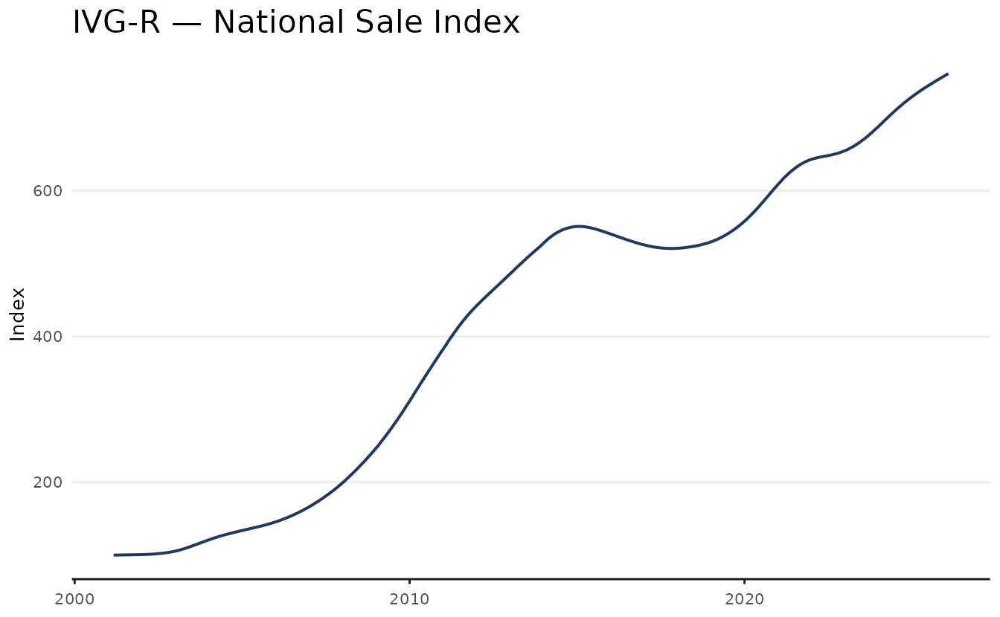

### IGMI-R

The IGMI-R (Índice Geral do Mercado Imobiliário Residencial) is
published by Abecip/FGV. It uses a hedonic pricing model applied to
actual transaction prices, making it the most methodologically rigorous
city-level index available. Coverage spans major Brazilian cities from
2014.

``` r

igmi <- get_dataset("rppi", "igmi")

glimpse(igmi)
#> Rows: 1,617
#> Columns: 5
#> $ date      <date> 2014-01-01, 2014-01-01, 2014-01-01, 2014-01-01, 2014-01-01,…
#> $ name_muni <chr> "São Paulo", "Rio De Janeiro", "Belo Horizonte", "Fortaleza"…
#> $ index     <dbl> 100.00000, 100.00000, 100.00000, 100.00000, 100.00000, 100.0…
#> $ chg       <dbl> NA, NA, NA, NA, NA, NA, NA, NA, NA, NA, NA, 0.0003654000, 0.…
#> $ acum12m   <dbl> NA, NA, NA, NA, NA, NA, NA, NA, NA, NA, NA, NA, NA, NA, NA, …
```

``` r

main_cities <- c("São Paulo", "Rio De Janeiro", "Belo Horizonte", "Brasília")

subigmi <- igmi |>
  filter(name_muni %in% main_cities)

ggplot(subigmi, aes(date, index, color = name_muni)) +
  geom_line(linewidth = 0.8) +
  labs(
    title = "IGMI-R — Sale Index by City",
    x = NULL,
    y = "Index",
    color = NULL
  ) +
  theme_series()
```

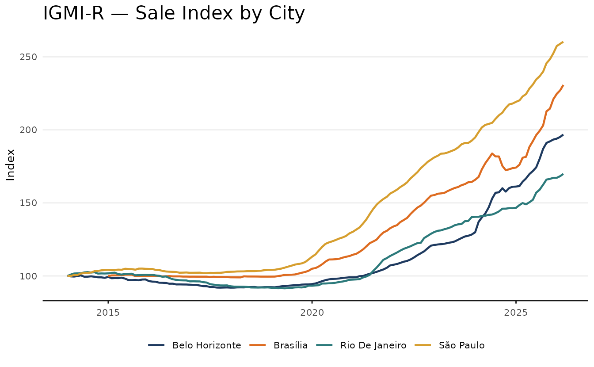

### FipeZap (sale)

FipeZap is the broadest RPPI in terms of geographic coverage, with
indices for more than 50 cities. It is based on median **listing
prices** rather than transaction prices. Available from 2008 for both
residential and commercial markets, with breakdowns by number of
bedrooms. Prices are stratified by region and income level, using Census
weights, and the final series is smoothed using a 3-month moving
average.

Key columns specific to FipeZap:

- `market` (residential/commercial),
- `rent_sale` (rent/sale),
- `rooms` (1, 2, 3, 4+, total),
- `variable` (index, chg, acum12m, price_m2, yield).

``` r

fz <- get_dataset("rppi", table = "fipezap")

glimpse(fz)
#> Rows: 677,160
#> Columns: 7
#> $ date      <date> 2008-01-01, 2008-01-01, 2008-01-01, 2008-01-01, 2008-01-01,…
#> $ name_muni <chr> "Brazil", "Brazil", "Brazil", "Brazil", "Brazil", "Brazil", …
#> $ market    <chr> "residential", "residential", "residential", "residential", …
#> $ rent_sale <chr> "sale", "sale", "sale", "sale", "sale", "sale", "sale", "sal…
#> $ variable  <chr> "index", "index", "index", "index", "index", "chg", "chg", "…
#> $ rooms     <chr> "total", "1", "2", "3", "4", "total", "1", "2", "3", "4", "t…
#> $ value     <dbl> 41.81107, 39.46609, 40.45048, 43.47948, 47.09432, NA, NA, NA…
```

Working with this dataset requires more complex filtering. For most use
cases, however, the main choices are selecting the `market` (either
‘residential’ or ‘commercial’), `rent_sale` (either ‘sale’ or ‘rent’),
and the desired `variable`.

``` r

subzap <- fz |>
  filter(
    market == "residential",
    rent_sale == "sale",
    rooms == "total",
    variable == "index",
    name_muni %in% main_cities
  )
```

``` r

ggplot(subzap, aes(date, value, color = name_muni)) +
  geom_line(linewidth = 0.8) +
  labs(
    title = "FipeZap — Residential Sale Index",
    x = NULL,
    y = "Index",
    color = NULL
  ) +
  theme_series()
```

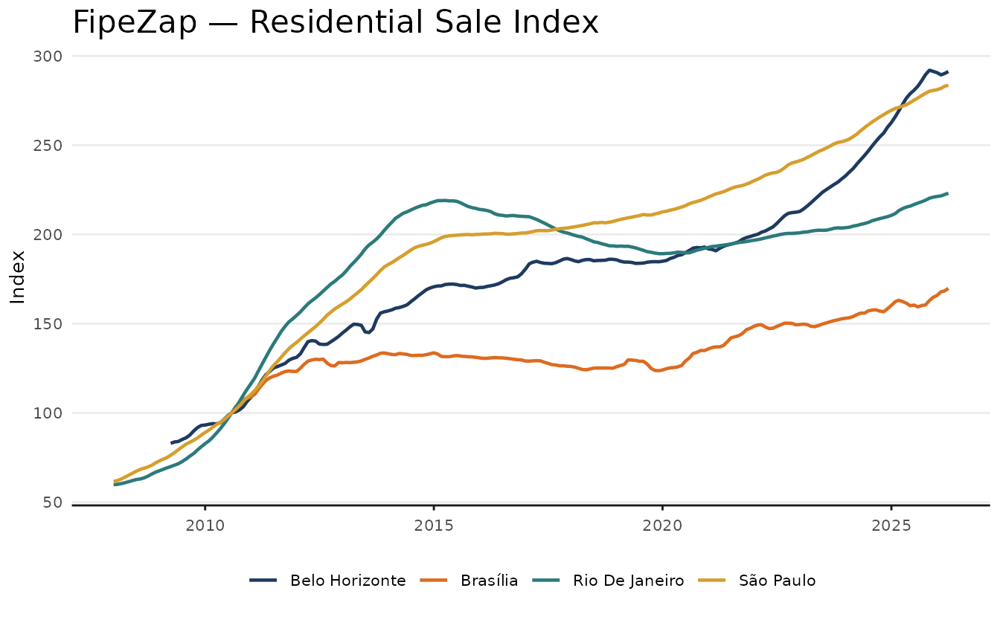

### Comparing indices

As mentioned above, the `table` parameter accepts a `"sale"` argument,
which stacks all available indices into a single `tibble`.

``` r

sale_indices <- get_dataset("rppi", "sale")

glimpse(sale_indices)
#> Rows: 14,400
#> Columns: 6
#> $ date      <date> 2014-01-01, 2014-01-01, 2014-01-01, 2014-01-01, 2014-01-01,…
#> $ name_muni <chr> "São Paulo", "Rio De Janeiro", "Belo Horizonte", "Fortaleza"…
#> $ index     <dbl> 100.00000, 100.00000, 100.00000, 100.00000, 100.00000, 100.0…
#> $ chg       <dbl> NA, NA, NA, NA, NA, NA, NA, NA, NA, NA, NA, 0.0003654000, 0.…
#> $ acum12m   <dbl> NA, NA, NA, NA, NA, NA, NA, NA, NA, NA, NA, NA, NA, NA, NA, …
#> $ source    <chr> "IGMI-R", "IGMI-R", "IGMI-R", "IGMI-R", "IGMI-R", "IGMI-R", …
```

For convenience, the stacked version of the dataset implicitly only
includes `rooms == "total"` for FipeZap. Also, “Brazil” (spelled with a
‘z’) is listed under `name_muni`, which shows the nation-wide index,
instead of the city specific ones.

The plot shows the three sale indexes at a national level. While there’s
some convergence between the indices, there is a growing gap between
them in the post-pandemic years. This highlights the importance of
choosing the right index for your use case.

``` r

comp_index <- sale_indices |>
  filter(name_muni == "Brazil", date >= as.Date("2015-01-01"))
```

``` r

ggplot(comp_index, aes(date, acum12m * 100, color = source)) +
  geom_line(linewidth = 0.7) +
  labs(
    title = "Comparing Sale Indices in Brazil",
    subtitle = "12-month accumulated change (%)",
    y = "%",
    color = NULL
  ) +
  theme_series()
```

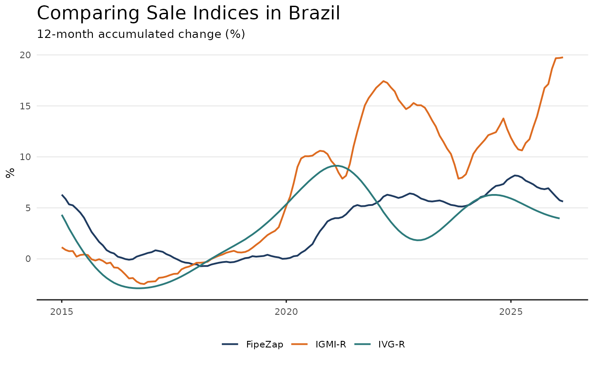

## Rent Indices

### IVAR

The IVAR (Índice de Variação de Aluguéis Residenciais) is published by
FGV and uses a repeat-rent methodology applied to actual rental
contracts. It covers major Brazilian cities from 2019 and is available
at both city and national level. Notably, the index has no smoothing,
making it rather volatile.

``` r

ivar <- get_dataset("rppi", table = "ivar")

glimpse(ivar)
#> Rows: 440
#> Columns: 5
#> $ date      <date> 2018-12-01, 2018-12-01, 2018-12-01, 2018-12-01, 2018-12-01,…
#> $ name_muni <chr> NA, "São Paulo", "Rio De Janeiro", "Belo Horizonte", "Porto …
#> $ index     <dbl> 100.000, 100.000, 100.000, 100.000, 100.000, 99.852, 99.731,…
#> $ chg       <dbl> NA, NA, NA, NA, NA, -1.480000e-03, -2.690000e-03, 8.310000e-…
#> $ acum12m   <dbl> NA, NA, NA, NA, NA, NA, NA, NA, NA, NA, NA, NA, NA, NA, NA, …
```

For the plot, I add a 5-month moving average using the `trendseries`
package.

``` r

library(trendseries)

ivar_trend <- ivar |>
  filter(name_muni != "Brazil") |>
  augment_trends(
    value_col = "index",
    group_cols = "name_muni",
    method = "ma",
    window = 5
    )
```

``` r

ggplot(ivar_trend, aes(date, color = name_muni)) +
  geom_line(aes(y = index), lwd = 0.5, alpha = 0.5) +
  geom_line(aes(y = trend_ma), lwd = 0.7) +
  geom_hline(yintercept = 100) +
  scale_x_date(date_breaks = "1 year", date_labels = "%Y") +
  labs(
    title = "IVAR — City Rent Indices",
    subtitle = "Smoothed moving average (5-month window)",
    x = NULL,
    y = "Index"
  ) +
  theme_series()
```

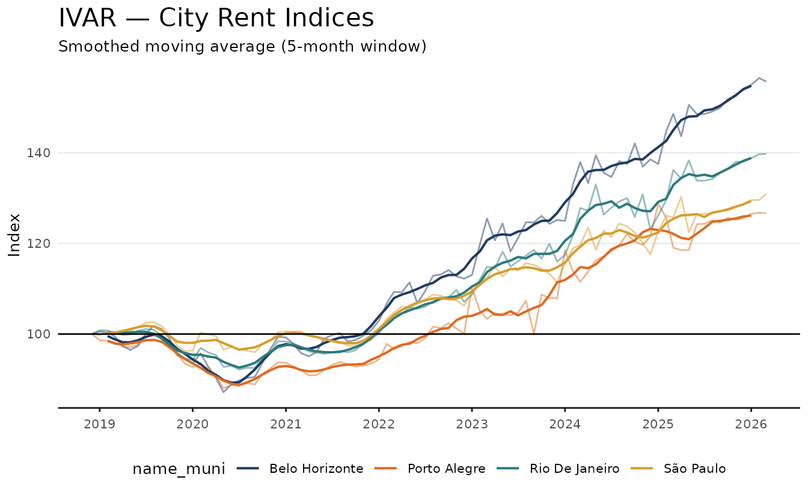

### IQA and IQAIW

QuintoAndar published two successive rental indices for São Paulo and
Rio de Janeiro. The **IQA** (2019–mid-2023) was based on median contract
prices. In mid-2023 it rebranded to **IQAIW** (Índice QuintoAndar
ImovelWeb) and adopted a hedonic model incorporating both listing and
contract prices. The two series are not directly comparable due to the
methodology break.

The original IQA compared median contract prices, stratified by region
and income level (using Census weights, similar to FipeZap). The IQAIW
uses a hedonic model (spatial GAM), double imputation, and a similar
Census-based stratification.

Notably, the IQA returns rent prices (R\$/m²) rather than an index, so a
base-100 normalisation is needed to build an index. For convenience, the
distribution includes a simple index based on first available value.

``` r

iqa <- get_dataset("rppi", "iqa")
iqaiw <- get_dataset("rppi", "iqaiw")

glimpse(iqaiw)
#> Rows: 1,660
#> Columns: 6
#> $ date      <date> 2019-05-01, 2019-10-01, 2019-11-01, 2019-12-01, 2020-01-01,…
#> $ name_muni <chr> "Belo Horizonte", "Belo Horizonte", "Belo Horizonte", "Belo …
#> $ rooms     <chr> "total", "total", "total", "total", "total", "total", "total…
#> $ index     <dbl> 100.0000, 100.1882, 100.4708, 100.6167, 101.3517, 102.6531, …
#> $ chg       <dbl> NA, 0.003514777, 0.002820158, 0.001452626, 0.007304582, 0.01…
#> $ acum12m   <dbl> NA, NA, NA, NA, NA, NA, NA, NA, 0.07024414, 0.07004492, 0.07…
```

``` r

ggplot(iqa, aes(date, index, color = name_muni)) +
  geom_line(linewidth = 0.7) +
  geom_hline(yintercept = 100) +
  scale_x_date(date_breaks = "1 year", date_labels = "%Y") +
  labs(
    title = "IQA — Rent Index",
    subtitle = "Index (2019/06 = 100)",
    y = "Index",
    color = NULL
  ) +
    theme_series()
```

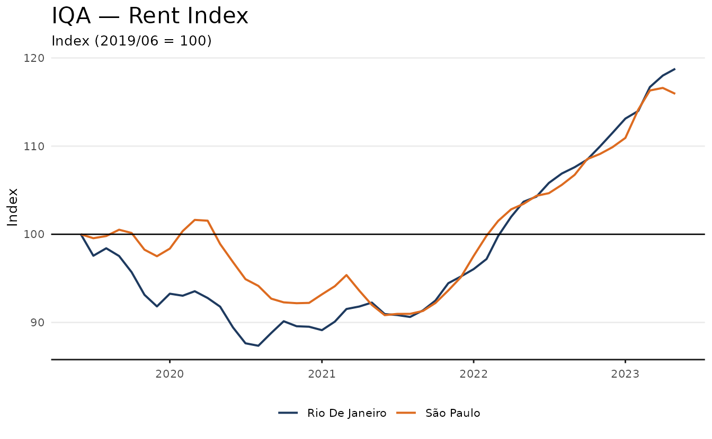

The newer IQAIW index has more cities and, similar to FipeZap, has a
bedroom stratification (`rooms`).

``` r

ggplot(subset(iqaiw, rooms == "total" & !is.na(acum12m)), aes(date, acum12m * 100, color = name_muni)) +
  geom_line(linewidth = 0.7) +
  scale_x_date(date_breaks = "1 year", date_labels = "%Y") +
  labs(
    title = "IQAIW — Rent Index",
    subtitle = "Accumulated 12-month change (%)",
    y = "%",
    color = NULL
  ) +
  theme_series()
```

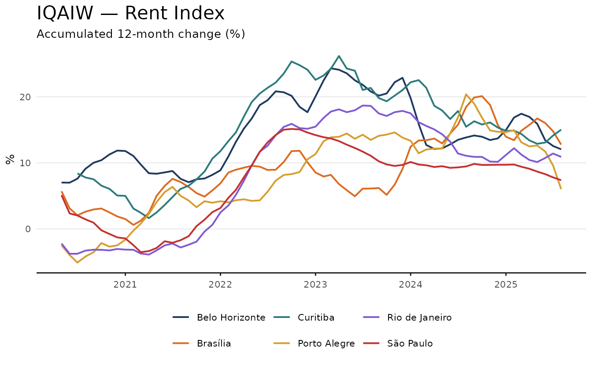

Finally, note that IQAIW is effectively the newer (and improved) version
of the older IQA index, which is kept for historical purposes.

``` r

quintoandar <- bind_rows(
  list("IQA" = iqa, "IQAIW" = iqaiw),
  .id = "source"
)

quintoandar_spo <- quintoandar |>
  filter(name_muni == "São Paulo", !rooms %in% c("1", "2", "3"))
```

``` r

ggplot(quintoandar_spo, aes(date, index, color = source)) +
  geom_line(linewidth = 0.7) +
  geom_hline(yintercept = 100) +
  scale_x_date(date_breaks = "1 year", date_labels = "%Y") +
  labs(
    title = "QuintoAndar Rent Index — São Paulo",
    subtitle = "IQA (pre-2023) and IQAIW (post-2023) use different methodologies",
    x = NULL,
    y = "Index",
    color = NULL
  ) +
  theme_series()
```

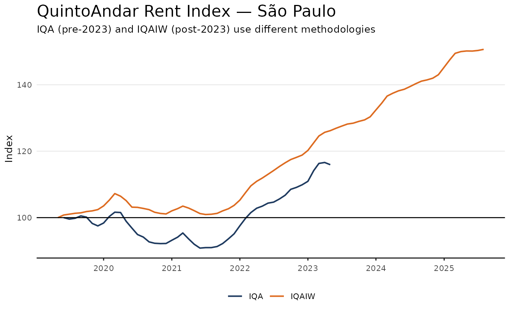

### FipeZap (rent)

FipeZap provides the broadest geographic coverage for rental indices,
but is based on median listing prices rather than contracts. The example
below shows the 12-month accumulated change across cities with complete
data from 2021.

``` r

fz <- get_dataset("rppi", table = "fipezap")

glimpse(fz)
#> Rows: 677,160
#> Columns: 7
#> $ date      <date> 2008-01-01, 2008-01-01, 2008-01-01, 2008-01-01, 2008-01-01,…
#> $ name_muni <chr> "Brazil", "Brazil", "Brazil", "Brazil", "Brazil", "Brazil", …
#> $ market    <chr> "residential", "residential", "residential", "residential", …
#> $ rent_sale <chr> "sale", "sale", "sale", "sale", "sale", "sale", "sale", "sal…
#> $ variable  <chr> "index", "index", "index", "index", "index", "chg", "chg", "…
#> $ rooms     <chr> "total", "1", "2", "3", "4", "total", "1", "2", "3", "4", "t…
#> $ value     <dbl> 41.81107, 39.46609, 40.45048, 43.47948, 47.09432, NA, NA, NA…
```

Note that this table is the same as the one used in the previous sales
example.

``` r

fz_rent <- fz |>
  filter(
    market == "residential",
    rent_sale == "rent",
    rooms == "total",
    variable == "acum12m",
    date >= as.Date("2019-01-01")
  )

sel_cities <- fz_rent |>
  filter(date == "2019-01-01", !is.na(value)) |>
  pull(name_muni)
```

The plot emphasizes the main strength of FipeZap’s index: its broad
geographic coverage.

``` r

ggplot(subset(fz_rent, name_muni %in% sel_cities), aes(date, value * 100)) +
  geom_line(linewidth = 0.7, color = color_palette[1]) +
  geom_hline(yintercept = 0) +
  facet_wrap(vars(name_muni)) +
  labs(
    title = "FipeZap — 12-month Rent Change by City",
    x = NULL,
    y = "Accumulated 12-month change (%)"
  ) +
  theme_series()
```

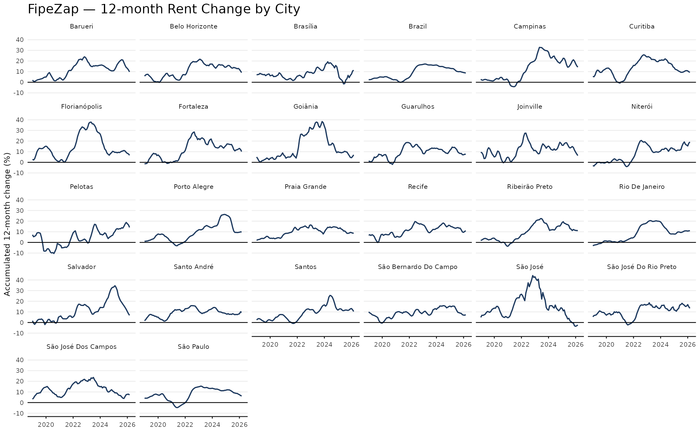

### SECOVI-SP

SECOVI-SP publishes a residential rent index for the city of São Paulo.
The series tracks median contract prices for residential leases and is
available from 2008, making it one of the longest rent series for a
single Brazilian city.

``` r

secovi <- get_dataset("rppi", "secovi_sp")

glimpse(secovi)
#> Rows: 236
#> Columns: 5
#> $ date      <date> 2004-12-01, 2005-01-01, 2005-02-01, 2005-03-01, 2005-04-01,…
#> $ name_muni <chr> "São Paulo", "São Paulo", "São Paulo", "São Paulo", "São Pau…
#> $ index     <dbl> 100.000, 100.500, 100.802, 101.003, 101.104, 101.306, 101.71…
#> $ chg       <dbl> NA, 0.0050000000, 0.0030049751, 0.0019940081, 0.0009999703, …
#> $ acum12m   <dbl> NA, NA, NA, NA, NA, NA, NA, NA, NA, NA, NA, NA, 0.04176000, …
```

``` r

ggplot(secovi, aes(date, acum12m * 100)) +
  geom_line(color = color_palette[1], linewidth = 0.7) +
  geom_hline(yintercept = 0) +
  scale_x_date(date_breaks = "2 years", date_labels = "%Y") +
  labs(
    title = "SECOVI-SP — Residential Rent Index",
    subtitle = "12-month accumulated change (%)",
    x = NULL,
    y = "%"
  ) +
  theme_series()
```

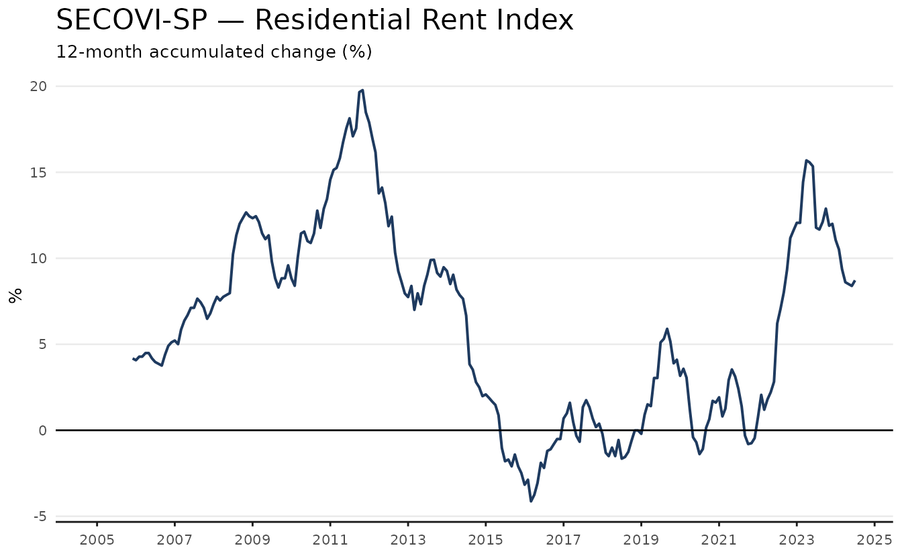

## Comparing Indices

### Stacked tables

The `"sale"` and `"rent"` tables stack all available indices into a
single data frame, making cross-source comparisons straightforward.

``` r

rent_indices <- get_dataset("rppi", "rent")
```

``` r

rent_indices_comp <- rent_indices |>
  filter(
    name_muni %in% c("São Paulo", "Rio de Janeiro"),
    date >= as.Date("2019-01-01")
  )
```

``` r

ggplot(rent_indices_comp, aes(date, acum12m, color = source)) +
  geom_line(linewidth = 0.7) +
  geom_hline(yintercept = 0) +
  facet_wrap(vars(name_muni)) +
  scale_x_date(date_breaks = "1 year", date_labels = "%Y") +
  labs(
    title = "Rent Indices — São Paulo and Rio de Janeiro",
    subtitle = "12-month accumulated change",
    y = "Accumulated change",
    color = NULL
  ) +
  theme_series()
```

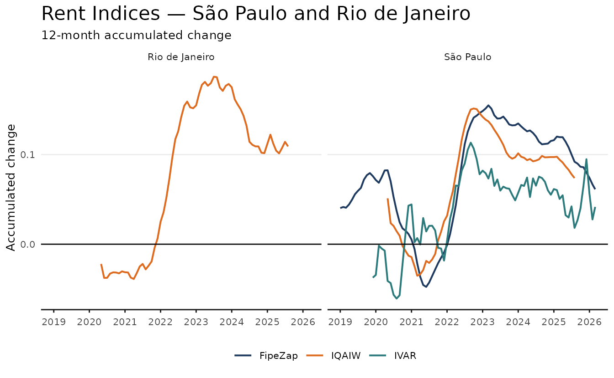

### Normalising to a common base

Each index has its own base period, so normalisation is required before
comparing levels. The example below rebases all national sale indices to
January 2018 = 100.

``` r

sales <- get_dataset("rppi", "sale")

national <- sales |>
  filter(name_muni == "Brazil", date >= as.Date("2018-01-01"))

national_rebased <- national |>
  mutate(
    index_rebased = index / first(index) * 100,
    .by = source
  )

total_growth <- national_rebased |>
  summarise(
    growth = last(index_rebased) - first(index_rebased),
    date = last(date),
    index_rebased = last(index_rebased),
    .by = source
  ) |>
  mutate(label = sprintf("%s:\n+%.1f%%", source, growth))
```

``` r

ggplot(national_rebased, aes(date, index_rebased, color = source)) +
  geom_line(linewidth = 0.8) +
  geom_hline(yintercept = 100) +
  geom_label(
    data = total_growth,
    aes(label = label),
    hjust = 0,
    nudge_x = 30,
    nudge_y = c(-5, 10, -5),
    show.legend = FALSE,
    size = 3
  ) +
  scale_x_date(
    date_breaks = "1 year",
    date_labels = "%Y",
    expand = expansion(mult = c(0, 0.125))
  ) +
  labs(
    title = "Brazil National Sale Indices — Rebased to Jan 2018",
    x = NULL,
    y = "Index (Jan 2018 = 100)",
    color = NULL
  ) +
  theme_series()
```

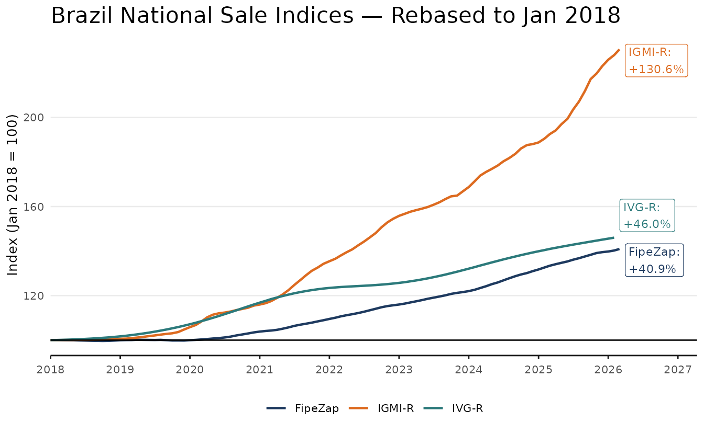

### Rent vs sale divergence

The post-pandemic divergence between rental and sale markets is one of
the most discussed trends in Brazilian real estate. FipeZap, which
covers both markets, makes this comparison straightforward.

``` r

fz <- get_dataset("rppi", "fipezap")

cities <- c("São Paulo", "Rio De Janeiro", "Belo Horizonte")
base_year <- 2019

base_avg <- fz |>
  filter(
    name_muni %in% cities,
    market   == "residential",
    rooms    == "total",
    variable == "index",
    lubridate::year(date) == base_year
  ) |>
  summarise(base = mean(value, na.rm = TRUE), .by = c(name_muni, rent_sale))

fz_divergence <- fz |>
  filter(
    name_muni %in% cities,
    market   == "residential",
    rooms    == "total",
    variable == "index",
    date     >= as.Date("2019-01-01")
  ) |>
  left_join(base_avg, by = c("name_muni", "rent_sale")) |>
  mutate(idx = 100 * value / base)
```

``` r

ggplot(fz_divergence, aes(date, idx, color = rent_sale)) +
  geom_line(linewidth = 0.8) +
  geom_hline(yintercept = 100, linetype = "dashed", alpha = 0.4) +
  facet_wrap(vars(name_muni)) +
  labs(
    title    = "Post-pandemic Rent vs Sale Divergence",
    subtitle = "FipeZap residential index, 2019 average = 100",
    x        = NULL,
    y        = "Index",
    color    = NULL
  ) +
  theme_series()
```

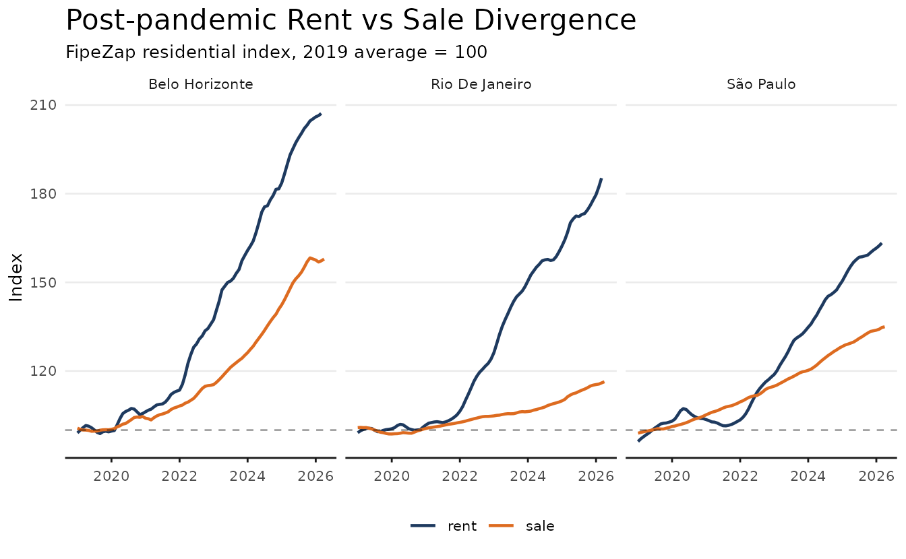

## International: BIS

The BIS dataset provides quarterly residential property price indices
for 60+ countries, enabling Brazil to be placed in international
context.

``` r

bis <- get_dataset("rppi_bis")

bis_sub <- bis |>
  filter(
    ref_area_name %in% c("Brazil", "United States", "Germany", "Japan"),
    is_nominal == 0,
    unit == "index",
    date >= as.Date("2000-01-01")
  )
```

``` r

ggplot(bis_sub, aes(date, value, color = ref_area_name)) +
  geom_line(linewidth = 0.8) +
  geom_hline(yintercept = 100, linetype = "dashed", alpha = 0.4) +
  labs(
    title = "Real Residential Property Prices",
    subtitle = "BIS, index 2010 = 100",
    x = NULL,
    y = "Index",
    color = NULL
  ) +
  theme_series()
```

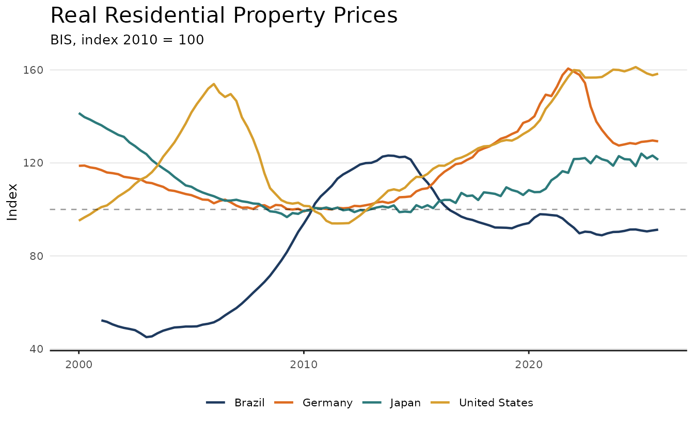

## Index Reference

| Index | Source | Coverage | Methodology | From |
|----|----|----|----|----|
| IVG-R | BCB | National | Median appraisal prices, HP-filtered | 2001 |
| IGMI-R | ABECIP/FGV | Major cities | Hedonic (transaction prices) | 2014 |
| FipeZap | FIPE/ZAP | 50 cities | Median listing prices | 2008 |
| IVAR | FGV | Major cities + national | Repeat-rent (contracts) | 2019 |
| IQA | QuintoAndar | São Paulo, Rio | Median contract prices | 2019 |
| IQAIW | QuintoAndar | São Paulo, Rio | Hedonic (listing + contracts) | 2023 |
| Secovi-SP | SECOVI-SP | São Paulo | Median prices (transactions) | 2008 |
