# Working with Property Price Indices

## Introduction

Brazil has several residential property price indices (RPPIs), each
built by a different institution and each with its own methodology,
geographic coverage, and time span. This article shows how to reach
every one of them through `get_dataset("rppi")`. Since `realestatebr`
returns tibbles, we recommend using it together with `dplyr`.

``` r

library(realestatebr)
library(dplyr)
```

The code below defines an optional common theme for the plots in this
article. It can be omitted.

``` r

library(ggplot2)

color_palette <- c(
  "#1E3A5F",
  "#DD6B20",
  "#2C7A7B",
  "#D69E2E",
  "#805AD5",
  "#C53030"
)

theme_series <- function() {
  theme_minimal(base_size = 10) +
    theme(
      plot.title = element_text(size = 16),
      panel.grid.minor = element_blank(),
      panel.grid.major.x = element_blank(),
      axis.line.x = element_line(color = "gray10", linewidth = 0.5),
      axis.ticks.x = element_line(color = "gray10", linewidth = 0.5),
      axis.title.x = element_blank(),
      legend.position = "bottom",
      palette.color.discrete = color_palette
    )
}
```

## Choosing an index

The IGMI-R is a good default for sale prices and the IVAR for rent
prices. FipeZap is the main option for commercial prices. Because the
indices draw on different source data and methods, the right choice
depends on the question.

The IGMI-R is a hedonic price index based on transaction prices from
housing mortgages. Its limits are the short time span (2014-present) and
the coverage of major cities only.

The IVAR is a repeat-rent index based on residential rental contracts.
It also starts late (2019) and covers four cities.

FipeZap has the widest geographic (50+ cities) and temporal coverage
(2008-present), but rests on median listing prices rather than
transaction prices. It answers questions about advertised prices, not
about what buyers actually paid.

### Working with realestatebr

To get a dataset, use
[`get_dataset()`](https://viniciusoike.github.io/realestatebr/reference/get_dataset.md)

``` r

igmi <- get_dataset("rppi", table = "igmi")
ivar <- get_dataset("rppi", table = "ivar")
fipezap <- get_dataset("rppi", table = "fipezap")
```

For easier comparison between indices, the `table` parameter accepts
`"sale"` and `"rent"` as options, which stack the available indices into
a single `tibble`.

``` r

sale <- get_dataset("rppi", table = "sale")
rent <- get_dataset("rppi", table = "rent")
```

## Sale indices

### IVG-R

The IVG-R (Índice de Valores de Garantia de Imóveis Residenciais) is
published by the Brazilian Central Bank. It covers the national market
from 2001 and is widely regarded as the official RPPI in Brazil. The
index is based on median appraisal prices from mortgage contracts,
smoothed with a 3-month moving average and the HP filter.

``` r

ivgr <- get_dataset("rppi", "ivgr")

glimpse(ivgr)
#> Rows: 304
#> Columns: 5
#> $ date     <date> 2001-03-01, 2001-04-01, 2001-05-01, 2001-06-01, 2001-07-01, …
#> $ name_geo <chr> "Brazil", "Brazil", "Brazil", "Brazil", "Brazil", "Brazil", "…
#> $ index    <dbl> 100.00, 100.08, 100.15, 100.22, 100.29, 100.36, 100.43, 100.4…
#> $ chg      <dbl> NA, 0.0008000000, 0.0006994404, 0.0006989516, 0.0006984634, 0…
#> $ acum12m  <dbl> NA, NA, NA, NA, NA, NA, NA, NA, NA, NA, NA, NA, 0.00980000, 0…
```

``` r

ggplot(ivgr, aes(date, index)) +
  geom_line(color = color_palette[1], linewidth = 0.7) +
  labs(
    title = "IVG-R — National Sale Index",
    x = NULL,
    y = "Index"
  ) +
  theme_series()
```

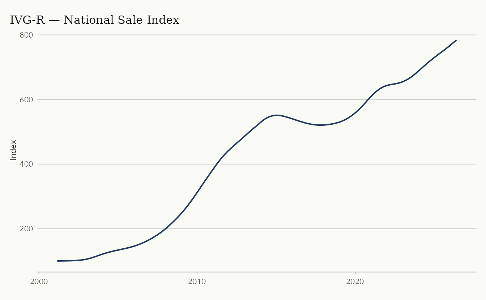

### IGMI-R

The IGMI-R (Índice Geral do Mercado Imobiliário Residencial) is
published by Abecip/FGV. It fits a hedonic pricing model to transaction
prices, so it tracks closed deals rather than asking prices. Coverage
spans major Brazilian cities from 2014.

``` r

igmi <- get_dataset("rppi", "igmi")

glimpse(igmi)
#> Rows: 1,639
#> Columns: 5
#> $ date      <date> 2014-01-01, 2014-01-01, 2014-01-01, 2014-01-01, 2014-01-01,…
#> $ name_muni <chr> "São Paulo", "Rio De Janeiro", "Belo Horizonte", "Fortaleza"…
#> $ index     <dbl> 100.00000, 100.00000, 100.00000, 100.00000, 100.00000, 100.0…
#> $ chg       <dbl> NA, NA, NA, NA, NA, NA, NA, NA, NA, NA, NA, 0.0003654000, 0.…
#> $ acum12m   <dbl> NA, NA, NA, NA, NA, NA, NA, NA, NA, NA, NA, NA, NA, NA, NA, …
```

``` r

main_cities <- c("São Paulo", "Rio De Janeiro", "Belo Horizonte", "Brasília")

subigmi <- igmi |>
  filter(name_muni %in% main_cities)

ggplot(subigmi, aes(date, index, color = name_muni)) +
  geom_line(linewidth = 0.8) +
  labs(
    title = "IGMI-R — Sale Index by City",
    x = NULL,
    y = "Index",
    color = NULL
  ) +
  theme_series()
```

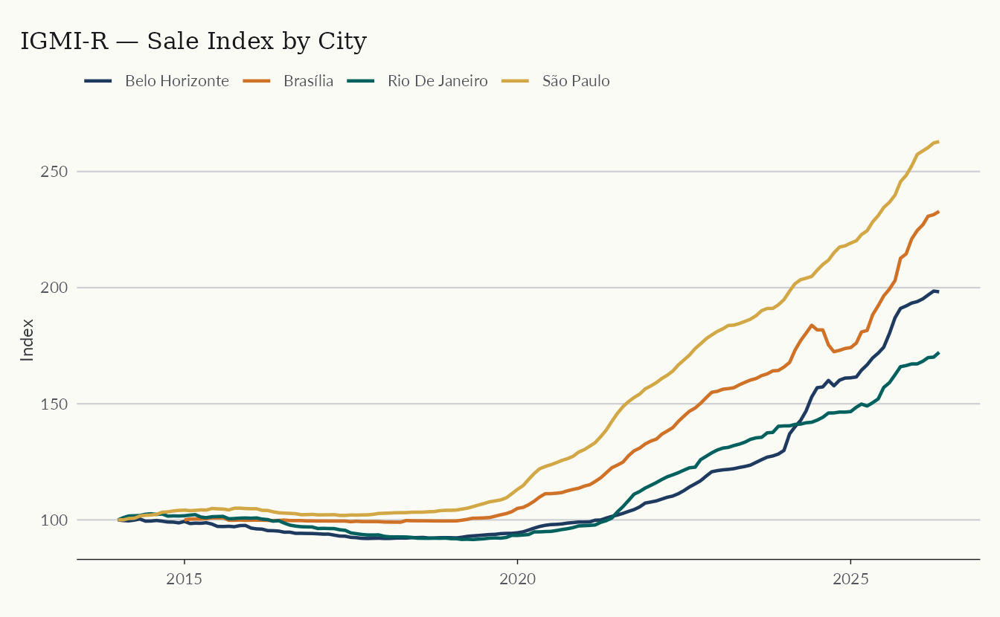

### FipeZap (sale)

FipeZap covers more than 50 cities, more than any other Brazilian RPPI,
and is based on median **listing prices** rather than transaction
prices. It runs from 2008 for both residential and commercial markets,
with breakdowns by number of bedrooms. Prices are stratified by region
and income level using Census weights, and the final series is smoothed
with a 3-month moving average.

Four columns are specific to FipeZap.

- `market` (residential/commercial)
- `rent_sale` (rent/sale)
- `rooms` (1, 2, 3, 4+, total)
- `variable` (index, chg, acum12m, price_m2, yield)

``` r

fz <- get_dataset("rppi", table = "fipezap")

glimpse(fz)
#> Rows: 686,394
#> Columns: 7
#> $ date      <date> 2008-01-01, 2008-01-01, 2008-01-01, 2008-01-01, 2008-01-01,…
#> $ name_muni <chr> "Brazil", "Brazil", "Brazil", "Brazil", "Brazil", "Brazil", …
#> $ market    <chr> "residential", "residential", "residential", "residential", …
#> $ rent_sale <chr> "sale", "sale", "sale", "sale", "sale", "sale", "sale", "sal…
#> $ variable  <chr> "index", "index", "index", "index", "index", "chg", "chg", "…
#> $ rooms     <chr> "total", "1", "2", "3", "4", "total", "1", "2", "3", "4", "t…
#> $ value     <dbl> 41.81107, 39.46609, 40.45048, 43.47948, 47.09432, NA, NA, NA…
```

Working with this dataset requires more filtering than the others. For
most uses the three choices that matter are `market` (‘residential’ or
‘commercial’), `rent_sale` (‘sale’ or ‘rent’), and the desired
`variable`.

``` r

subzap <- fz |>
  filter(
    market == "residential",
    rent_sale == "sale",
    rooms == "total",
    variable == "index",
    name_muni %in% main_cities
  )
```

``` r

ggplot(subzap, aes(date, value, color = name_muni)) +
  geom_line(linewidth = 0.8) +
  labs(
    title = "FipeZap — Residential Sale Index",
    x = NULL,
    y = "Index",
    color = NULL
  ) +
  theme_series()
```

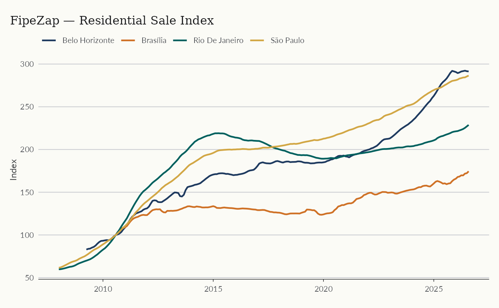

### Comparing sale indices

The `table` argument also accepts `"sale"`, which stacks the available
sale indices into a single `tibble`.

``` r

sale_indices <- get_dataset("rppi", "sale")

glimpse(sale_indices)
#> Rows: 14,654
#> Columns: 6
#> $ source    <chr> "IGMI-R", "IGMI-R", "IGMI-R", "IGMI-R", "IGMI-R", "IGMI-R", …
#> $ date      <date> 2014-01-01, 2014-01-01, 2014-01-01, 2014-01-01, 2014-01-01,…
#> $ name_muni <chr> "São Paulo", "Rio De Janeiro", "Belo Horizonte", "Fortaleza"…
#> $ index     <dbl> 100.00000, 100.00000, 100.00000, 100.00000, 100.00000, 100.0…
#> $ chg       <dbl> NA, NA, NA, NA, NA, NA, NA, NA, NA, NA, NA, 0.0003654000, 0.…
#> $ acum12m   <dbl> NA, NA, NA, NA, NA, NA, NA, NA, NA, NA, NA, NA, NA, NA, NA, …
```

The stacked table keeps only `rooms == "total"` for FipeZap, and the
nationwide index appears under `name_muni == "Brazil"` rather than a
city name.

The plot below shows the three national sale indices. They tracked each
other closely until the pandemic, after which the gap between them
widens.

``` r

comp_index <- sale_indices |>
  filter(name_muni == "Brazil", date >= as.Date("2015-01-01"))
```

``` r

ggplot(comp_index, aes(date, acum12m * 100, color = source)) +
  geom_line(linewidth = 0.7) +
  labs(
    title = "Comparing Sale Indices in Brazil",
    subtitle = "12-month accumulated change (%)",
    y = "%",
    color = NULL
  ) +
  theme_series()
```

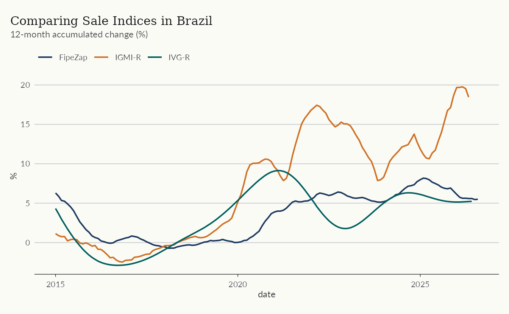

## Rent indices

### IVAR

The IVAR (Índice de Variação de Aluguéis Residenciais) is published by
FGV and uses a repeat-rent methodology applied to actual rental
contracts. It covers major Brazilian cities from 2019 and is available
at both city and national level. Notably, the index has no smoothing,
making it rather volatile.

``` r

ivar <- get_dataset("rppi", table = "ivar")

glimpse(ivar)
#> Rows: 455
#> Columns: 5
#> $ date      <date> 2018-12-01, 2018-12-01, 2018-12-01, 2018-12-01, 2018-12-01,…
#> $ name_muni <chr> NA, "São Paulo", "Rio De Janeiro", "Belo Horizonte", "Porto …
#> $ index     <dbl> 100.000, 100.000, 100.000, 100.000, 100.000, 99.852, 99.731,…
#> $ chg       <dbl> NA, NA, NA, NA, NA, -1.480000e-03, -2.690000e-03, 8.310000e-…
#> $ acum12m   <dbl> NA, NA, NA, NA, NA, NA, NA, NA, NA, NA, NA, NA, NA, NA, NA, …
```

The series is noisy, so the plot adds a 5-month moving average from the
`trendseries` package.

``` r

library(trendseries)

ivar_trend <- ivar |>
  filter(name_muni != "Brazil") |>
  augment_trends(
    value_col = "index",
    group_cols = "name_muni",
    methods = "ma",
    window = 5
  )
```

``` r

ggplot(ivar_trend, aes(date, color = name_muni)) +
  geom_line(aes(y = index), lwd = 0.5, alpha = 0.5) +
  geom_line(aes(y = trend_ma), lwd = 0.7) +
  geom_hline(yintercept = 100) +
  scale_x_date(date_breaks = "1 year", date_labels = "%Y") +
  labs(
    title = "IVAR — City Rent Indices",
    subtitle = "Smoothed moving average (5-month window)",
    x = NULL,
    y = "Index"
  ) +
  theme_series()
```

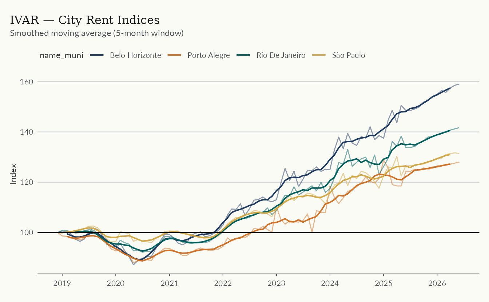

### IQA and IQAIW

QuintoAndar published two successive rental indices for São Paulo and
Rio de Janeiro. The **IQA** (2019–mid-2023) was based on median contract
prices. In mid-2023 it rebranded to **IQAIW** (Índice QuintoAndar
ImovelWeb) and adopted a hedonic model incorporating both listing and
contract prices. The two series are not directly comparable due to the
methodology break.

The original IQA compared median contract prices, stratified by region
and income level with Census weights, much like FipeZap. The IQAIW uses
a hedonic model (spatial GAM), double imputation, and a similar
Census-based stratification.

The IQA source data reports rent prices (R\$/m²) rather than an index,
so building an index requires a base-100 normalization. The package
ships an `index` column already normalized to the first available
observation.

``` r

iqa <- get_dataset("rppi", "iqa")
iqaiw <- get_dataset("rppi", "iqaiw")

glimpse(iqaiw)
#> Rows: 1,660
#> Columns: 6
#> $ date      <date> 2021-05-01, 2021-06-01, 2021-07-01, 2021-08-01, 2021-09-01,…
#> $ name_muni <chr> "Belo Horizonte", "Belo Horizonte", "Belo Horizonte", "Belo …
#> $ rooms     <chr> "1", "1", "1", "1", "1", "1", "1", "1", "1", "1", "1", "1", …
#> $ index     <dbl> 100.00000, 100.00508, 99.51814, 99.17578, 99.24295, 99.99587…
#> $ chg       <dbl> NA, 5.084921e-05, -4.869240e-03, -3.440099e-03, 6.772126e-04…
#> $ acum12m   <dbl> NA, NA, NA, NA, NA, NA, NA, NA, NA, NA, NA, NA, 0.1598557, 0…
```

``` r

ggplot(iqa, aes(date, index, color = name_muni)) +
  geom_line(linewidth = 0.7) +
  geom_hline(yintercept = 100) +
  scale_x_date(date_breaks = "1 year", date_labels = "%Y") +
  labs(
    title = "IQA — Rent Index",
    subtitle = "Index (2019/06 = 100)",
    y = "Index",
    color = NULL
  ) +
  theme_series()
```

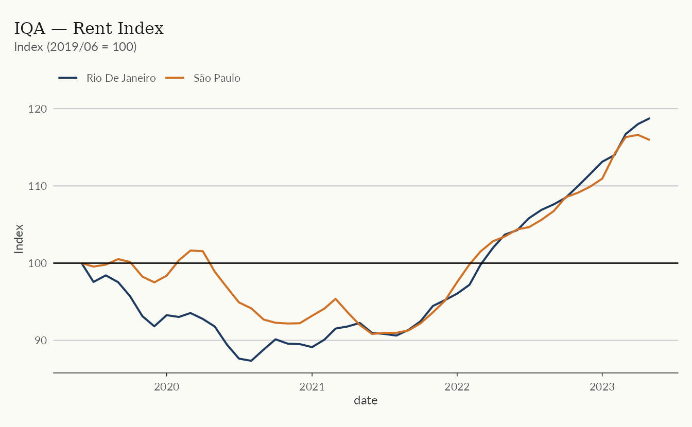

The newer IQAIW index covers more cities and, like FipeZap, breaks
results down by number of bedrooms (`rooms`).

``` r

ggplot(
  subset(iqaiw, rooms == "total" & !is.na(acum12m)),
  aes(date, acum12m * 100, color = name_muni)
) +
  geom_line(linewidth = 0.7) +
  scale_x_date(date_breaks = "1 year", date_labels = "%Y") +
  labs(
    title = "IQAIW — Rent Index",
    subtitle = "Accumulated 12-month change (%)",
    y = "%",
    color = NULL
  ) +
  theme_series()
```

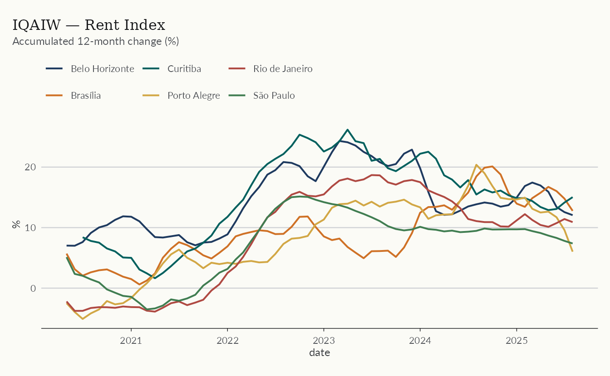

The package keeps the discontinued IQA for its history. Plotting both
series together shows where the methodology break falls.

``` r

quintoandar <- bind_rows(
  list(
    "IQA" = mutate(iqa, rooms = "total"),
    "IQAIW" = iqaiw
  ),
  .id = "source"
)

quintoandar_spo <- quintoandar |>
  filter(name_muni == "São Paulo", rooms == "total")
```

``` r

ggplot(quintoandar_spo, aes(date, index, color = source)) +
  geom_line(linewidth = 0.7) +
  geom_hline(yintercept = 100) +
  scale_x_date(date_breaks = "1 year", date_labels = "%Y") +
  labs(
    title = "QuintoAndar Rent Index — São Paulo",
    subtitle = "IQA (pre-2023) and IQAIW (post-2023) use different methodologies",
    x = NULL,
    y = "Index",
    color = NULL
  ) +
  theme_series()
```

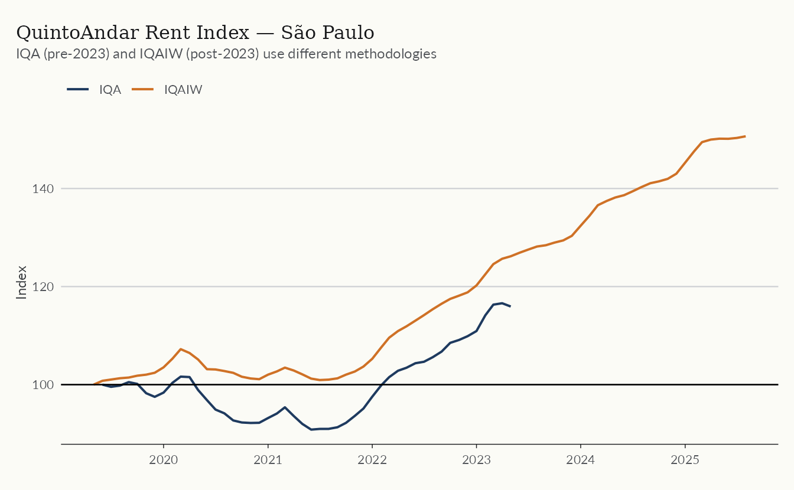

### FipeZap (rent)

FipeZap provides the broadest geographic coverage for rental indices,
but is based on median listing prices rather than contracts. The example
below shows the 12-month accumulated change across cities with complete
data from 2021.

``` r

fz <- get_dataset("rppi", table = "fipezap")

glimpse(fz)
#> Rows: 686,394
#> Columns: 7
#> $ date      <date> 2008-01-01, 2008-01-01, 2008-01-01, 2008-01-01, 2008-01-01,…
#> $ name_muni <chr> "Brazil", "Brazil", "Brazil", "Brazil", "Brazil", "Brazil", …
#> $ market    <chr> "residential", "residential", "residential", "residential", …
#> $ rent_sale <chr> "sale", "sale", "sale", "sale", "sale", "sale", "sale", "sal…
#> $ variable  <chr> "index", "index", "index", "index", "index", "chg", "chg", "…
#> $ rooms     <chr> "total", "1", "2", "3", "4", "total", "1", "2", "3", "4", "t…
#> $ value     <dbl> 41.81107, 39.46609, 40.45048, 43.47948, 47.09432, NA, NA, NA…
```

This is the same table used in the sale example above; only the
`rent_sale` filter changes.

``` r

fz_rent <- fz |>
  filter(
    market == "residential",
    rent_sale == "rent",
    rooms == "total",
    variable == "acum12m",
    date >= as.Date("2021-01-01")
  )

sel_cities <- fz_rent |>
  filter(date == as.Date("2021-01-01"), !is.na(value)) |>
  pull(name_muni)
```

The plot below uses every city with observations starting in 2021, which
shows how far FipeZap’s geographic coverage reaches.

``` r

ggplot(subset(fz_rent, name_muni %in% sel_cities), aes(date, value * 100)) +
  geom_line(linewidth = 0.7, color = color_palette[1]) +
  geom_hline(yintercept = 0) +
  facet_wrap(vars(name_muni)) +
  labs(
    title = "FipeZap — 12-month Rent Change by City",
    x = NULL,
    y = "Accumulated 12-month change (%)"
  ) +
  theme_series()
```

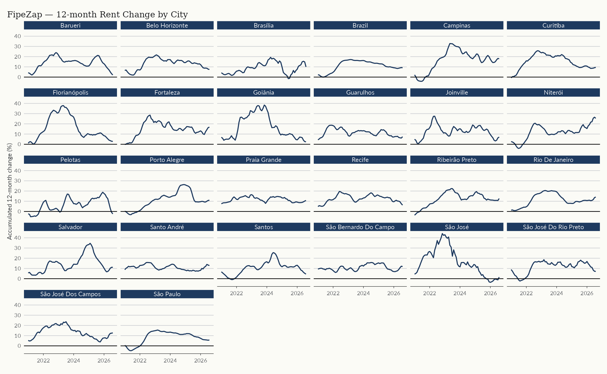

### SECOVI-SP

SECOVI-SP publishes a residential rent index for the city of São Paulo.
The series tracks median contract prices for residential leases and runs
from 2008, making it one of the longest rent series for a single
Brazilian city.

``` r

secovi <- get_dataset("rppi", "secovi_sp")

glimpse(secovi)
#> Rows: 236
#> Columns: 5
#> $ date      <date> 2004-12-01, 2005-01-01, 2005-02-01, 2005-03-01, 2005-04-01,…
#> $ name_muni <chr> "São Paulo", "São Paulo", "São Paulo", "São Paulo", "São Pau…
#> $ index     <dbl> 100.000, 100.500, 100.802, 101.003, 101.104, 101.306, 101.71…
#> $ chg       <dbl> NA, 0.0050000000, 0.0030049751, 0.0019940081, 0.0009999703, …
#> $ acum12m   <dbl> NA, NA, NA, NA, NA, NA, NA, NA, NA, NA, NA, NA, 0.04176000, …
```

``` r

ggplot(secovi, aes(date, acum12m * 100)) +
  geom_line(color = color_palette[1], linewidth = 0.7) +
  geom_hline(yintercept = 0) +
  scale_x_date(date_breaks = "2 years", date_labels = "%Y") +
  labs(
    title = "SECOVI-SP — Residential Rent Index",
    subtitle = "12-month accumulated change (%)",
    x = NULL,
    y = "%"
  ) +
  theme_series()
```

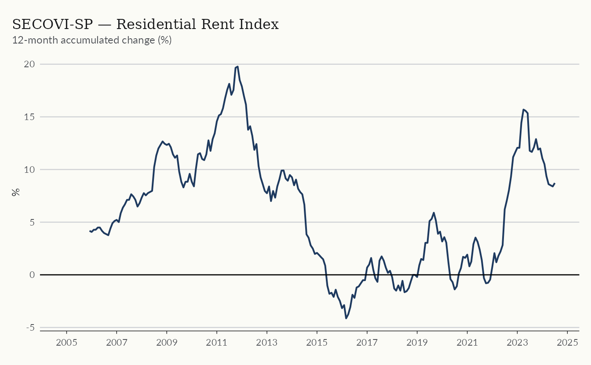

## Comparing indices

### Stacked tables

The `"sale"` and `"rent"` tables stack all available indices into a
single data frame, making cross-source comparisons straightforward.

``` r

rent_indices <- get_dataset("rppi", "rent")
```

``` r

rent_indices_comp <- rent_indices |>
  filter(
    name_muni %in% c("São Paulo", "Rio de Janeiro"),
    date >= as.Date("2019-01-01")
  )
```

``` r

ggplot(rent_indices_comp, aes(date, acum12m * 100, color = source)) +
  geom_line(linewidth = 0.7) +
  geom_hline(yintercept = 0) +
  facet_wrap(vars(name_muni)) +
  scale_x_date(date_breaks = "1 year", date_labels = "%Y") +
  labs(
    title = "Rent Indices — São Paulo and Rio de Janeiro",
    subtitle = "12-month accumulated change (%)",
    y = "Accumulated change (%)",
    color = NULL
  ) +
  theme_series()
```

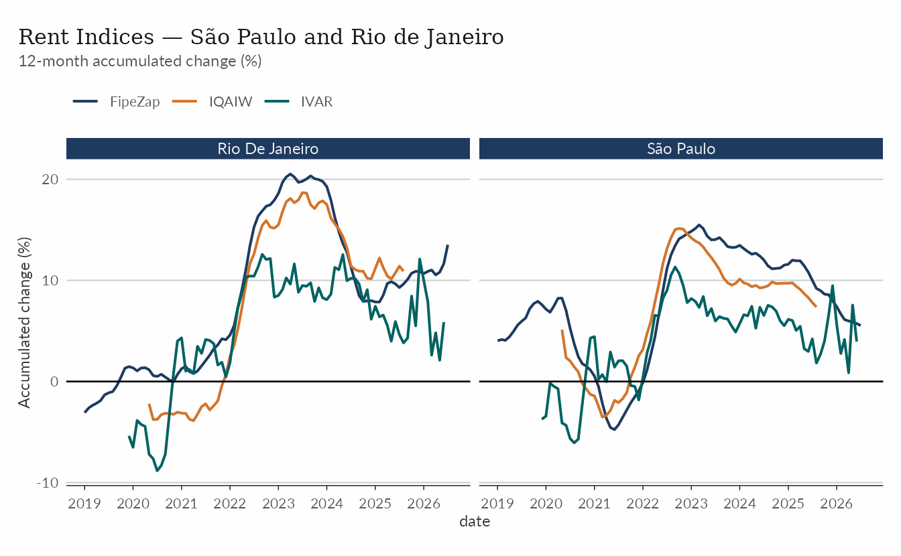

### Normalizing to a common base

Each index has its own base period, so levels are not comparable until
they share one. The example below rebases the national sale indices to
January 2018 = 100.

``` r

sales <- get_dataset("rppi", "sale")

national <- sales |>
  filter(
    name_muni == "Brazil",
    date >= as.Date("2018-01-01"),
    date <= as.Date("2023-12-01")
  )

national_rebased <- national |>
  arrange(source, date) |>
  mutate(
    index_rebased = index / first(index) * 100,
    .by = source
  )

total_growth <- national_rebased |>
  summarise(
    growth = last(index_rebased) - first(index_rebased),
    date = last(date),
    index_rebased = last(index_rebased),
    .by = source
  ) |>
  mutate(label = sprintf("%s:\n+%.1f%%", source, growth))
```

``` r

ggplot(national_rebased, aes(date, index_rebased, color = source)) +
  geom_line(linewidth = 0.8) +
  geom_hline(yintercept = 100) +
  geom_label(
    data = total_growth,
    aes(label = label),
    hjust = 0,
    nudge_x = 30,
    show.legend = FALSE,
    size = 3
  ) +
  scale_x_date(
    date_breaks = "1 year",
    date_labels = "%Y",
    expand = expansion(mult = c(0, 0.125))
  ) +
  labs(
    title = "Brazil National Sale Indices — Rebased to Jan 2018",
    x = NULL,
    y = "Index (Jan 2018 = 100)",
    color = NULL
  ) +
  theme_series()
```

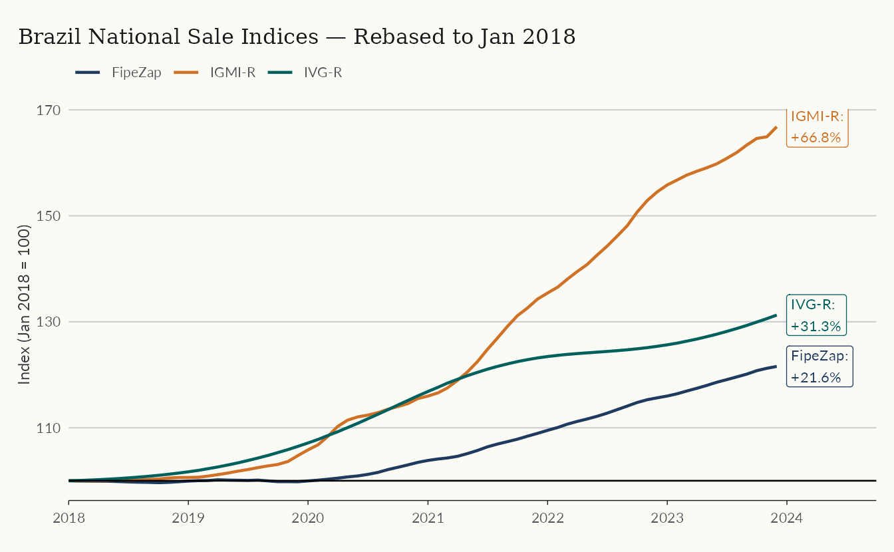

## International: BIS

The BIS dataset carries quarterly residential property price indices for
60+ countries, so you can compare Brazil against other markets.

``` r

bis <- get_dataset("rppi_bis")

bis_sub <- bis |>
  filter(
    ref_area_name %in% c("Brazil", "United States", "Germany", "Japan"),
    is_nominal == 0,
    unit == "index",
    date >= as.Date("2000-01-01")
  )
```

``` r

ggplot(bis_sub, aes(date, value, color = ref_area_name)) +
  geom_line(linewidth = 0.8) +
  geom_hline(yintercept = 100, linetype = "dashed", alpha = 0.4) +
  labs(
    title = "Real Residential Property Prices",
    subtitle = "BIS, index 2010 = 100",
    x = NULL,
    y = "Index",
    color = NULL
  ) +
  theme_series()
```

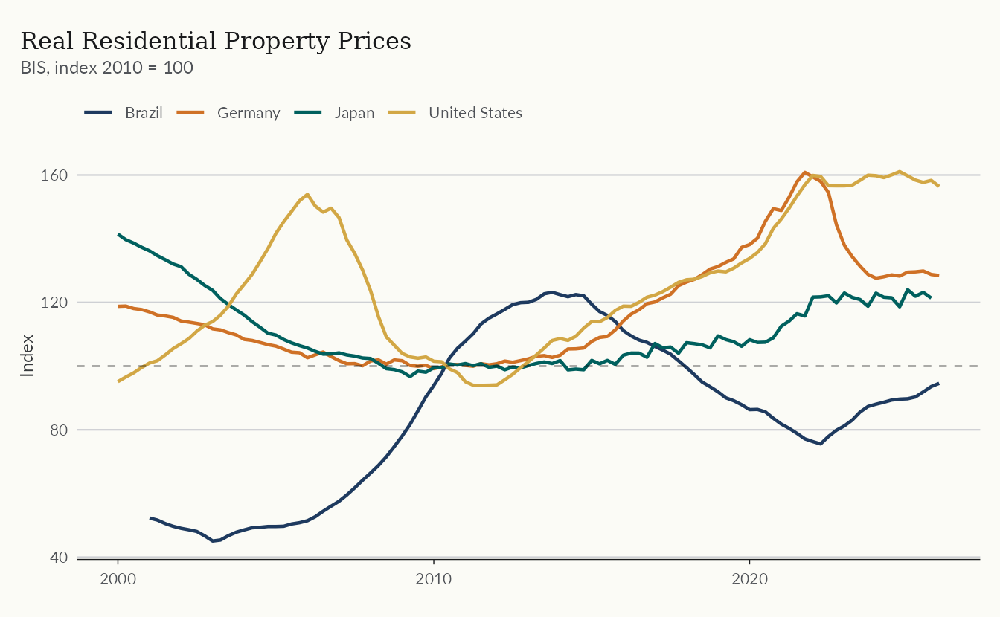

## Index reference

| Index | Source | Coverage | Methodology | From |
|----|----|----|----|----|
| IVG-R | BCB | National | Median appraisal prices, HP-filtered | 2001 |
| IGMI-R | ABECIP/FGV | Major cities | Hedonic (transaction prices) | 2014 |
| FipeZap | FIPE/ZAP | 50 cities | Median listing prices | 2008 |
| IVAR | FGV | Major cities + national | Repeat-rent (contracts) | 2019 |
| IQA | QuintoAndar | São Paulo, Rio | Median contract prices | 2019 |
| IQAIW | QuintoAndar | São Paulo, Rio | Hedonic (listing + contracts) | 2023 |
| SECOVI-SP | SECOVI-SP | São Paulo | Median prices (transactions) | 2008 |
